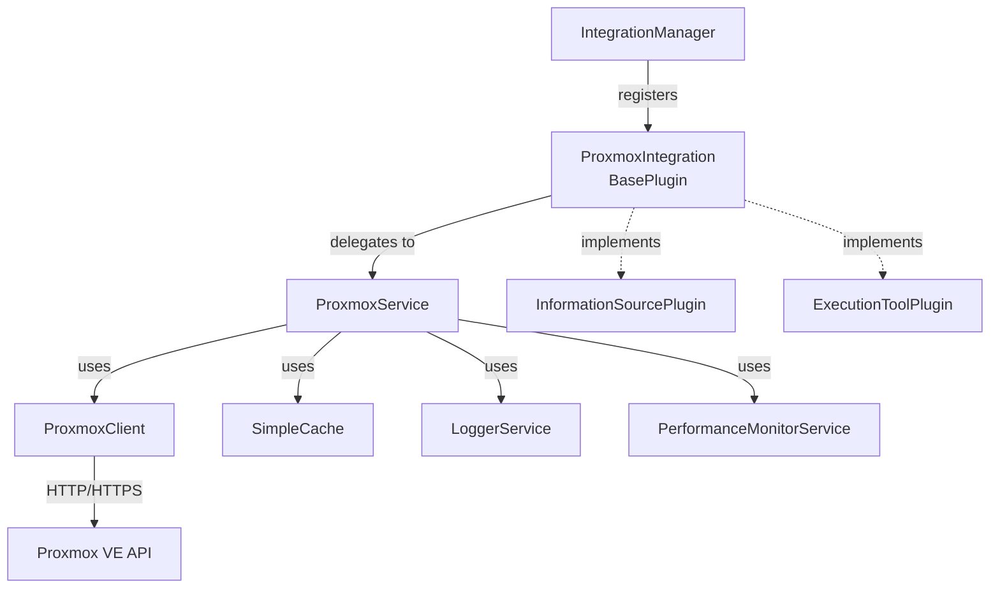
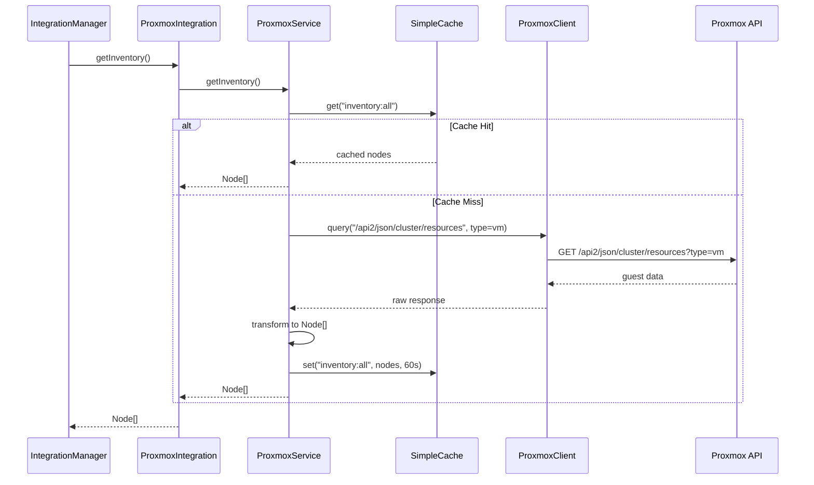
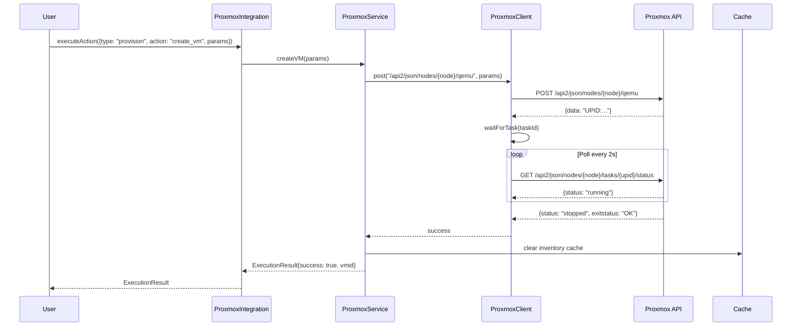
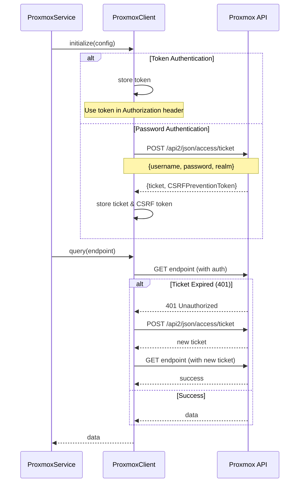

# Proxmox Integration Design Document

## Overview

This document describes the design for integrating Proxmox Virtual Environment (VE) into Pabawi. The integration follows the established plugin architecture pattern used by existing integrations (PuppetDB, Bolt, Ansible, SSH) and introduces a new "provisioning" capability type to enable VM and container lifecycle management.

### Key Components

- **ProxmoxIntegration**: Plugin class that implements both InformationSourcePlugin and ExecutionToolPlugin interfaces
- **ProxmoxService**: Business logic layer that orchestrates API calls and data transformation
- **ProxmoxClient**: Low-level HTTP client for Proxmox API communication with authentication and retry logic
- **ProvisioningCapability**: New capability interface for infrastructure provisioning operations

### Design Goals

1. Follow existing plugin architecture patterns for consistency
2. Support both information retrieval (inventory, facts, groups) and execution (actions, provisioning)
3. Provide robust error handling and resilience through retry logic and circuit breakers
4. Enable efficient operations through caching and parallel API calls
5. Support both password and token-based authentication
6. Introduce provisioning capabilities for VM and container lifecycle management

## Architecture

### High-Level Component Diagram



### Layer Responsibilities

**ProxmoxIntegration (Plugin Layer)**

- Extends BasePlugin
- Implements InformationSourcePlugin and ExecutionToolPlugin interfaces
- Handles plugin lifecycle (initialization, health checks)
- Delegates business logic to ProxmoxService
- Manages configuration validation

**ProxmoxService (Business Logic Layer)**

- Orchestrates API calls through ProxmoxClient
- Transforms Proxmox API responses to Pabawi data models
- Implements caching strategy for inventory, groups, and facts
- Handles data aggregation and grouping logic
- Manages provisioning operations (create/destroy VMs and containers)

**ProxmoxClient (HTTP Client Layer)**

- Handles HTTP/HTTPS communication with Proxmox API
- Manages authentication (ticket-based and token-based)
- Implements retry logic with exponential backoff
- Handles task polling for long-running operations
- Transforms HTTP errors into domain-specific exceptions

### Data Flow Diagrams

#### Inventory Retrieval Flow



#### VM Provisioning Flow



#### Authentication Flow



## Components and Interfaces

### ProxmoxIntegration Class

**File**: `pabawi/backend/src/integrations/proxmox/ProxmoxIntegration.ts`

```typescript
export class ProxmoxIntegration extends BasePlugin 
  implements InformationSourcePlugin, ExecutionToolPlugin {
  
  type = "both" as const;
  private service: ProxmoxService;
  
  constructor(logger?: LoggerService, performanceMonitor?: PerformanceMonitorService) {
    super("proxmox", "both", logger, performanceMonitor);
  }
  
  protected async performInitialization(): Promise<void> {
    // Extract and validate Proxmox configuration
    const config = this.config.config as ProxmoxConfig;
    this.validateProxmoxConfig(config);
    
    // Initialize service with configuration
    this.service = new ProxmoxService(config, this.logger, this.performanceMonitor);
    await this.service.initialize();
  }
  
  protected async performHealthCheck(): Promise<Omit<HealthStatus, "lastCheck">> {
    return await this.service.healthCheck();
  }
  
  // InformationSourcePlugin methods
  async getInventory(): Promise<Node[]> {
    return await this.service.getInventory();
  }
  
  async getGroups(): Promise<NodeGroup[]> {
    return await this.service.getGroups();
  }
  
  async getNodeFacts(nodeId: string): Promise<Facts> {
    return await this.service.getNodeFacts(nodeId);
  }
  
  async getNodeData(nodeId: string, dataType: string): Promise<unknown> {
    return await this.service.getNodeData(nodeId, dataType);
  }
  
  // ExecutionToolPlugin methods
  async executeAction(action: Action): Promise<ExecutionResult> {
    return await this.service.executeAction(action);
  }
  
  listCapabilities(): Capability[] {
    return this.service.listCapabilities();
  }
  
  listProvisioningCapabilities(): ProvisioningCapability[] {
    return this.service.listProvisioningCapabilities();
  }
  
  private validateProxmoxConfig(config: ProxmoxConfig): void {
    // Validate host (hostname or IP)
    if (!config.host || typeof config.host !== 'string') {
      throw new Error('Proxmox configuration must include a valid host');
    }
    
    // Validate port range
    if (config.port && (config.port < 1 || config.port > 65535)) {
      throw new Error('Proxmox port must be between 1 and 65535');
    }
    
    // Validate authentication
    if (!config.token && !config.password) {
      throw new Error('Proxmox configuration must include either token or password authentication');
    }
    
    // Validate realm for password auth
    if (config.password && !config.realm) {
      throw new Error('Proxmox password authentication requires a realm');
    }
    
    // Log security warning if cert verification disabled
    if (config.ssl?.rejectUnauthorized === false) {
      this.logger.warn('TLS certificate verification is disabled - this is insecure', {
        component: 'ProxmoxIntegration',
        operation: 'validateProxmoxConfig'
      });
    }
  }
}
```

### ProxmoxService Class

**File**: `pabawi/backend/src/integrations/proxmox/ProxmoxService.ts`

```typescript
export class ProxmoxService {
  private client: ProxmoxClient;
  private cache: SimpleCache;
  private logger: LoggerService;
  private performanceMonitor: PerformanceMonitorService;
  private config: ProxmoxConfig;
  
  constructor(
    config: ProxmoxConfig,
    logger: LoggerService,
    performanceMonitor: PerformanceMonitorService
  ) {
    this.config = config;
    this.logger = logger;
    this.performanceMonitor = performanceMonitor;
    this.cache = new SimpleCache({ ttl: 60000 }); // Default 60s
  }
  
  async initialize(): Promise<void> {
    this.client = new ProxmoxClient(this.config, this.logger);
    await this.client.authenticate();
  }
  
  async healthCheck(): Promise<Omit<HealthStatus, "lastCheck">> {
    try {
      const version = await this.client.get('/api2/json/version');
      return {
        healthy: true,
        message: 'Proxmox API is reachable',
        details: { version }
      };
    } catch (error) {
      if (error instanceof ProxmoxAuthenticationError) {
        return {
          healthy: false,
          degraded: true,
          message: 'Authentication failed',
          details: { error: error.message }
        };
      }
      return {
        healthy: false,
        message: 'Proxmox API is unreachable',
        details: { error: error instanceof Error ? error.message : String(error) }
      };
    }
  }
  
  async getInventory(): Promise<Node[]> {
    const cacheKey = 'inventory:all';
    const cached = this.cache.get(cacheKey);
    if (cached) return cached as Node[];
    
    const complete = this.performanceMonitor.startTimer('proxmox:getInventory');
    
    try {
      // Query all cluster resources (VMs and containers)
      const resources = await this.client.get('/api2/json/cluster/resources?type=vm');
      
      if (!Array.isArray(resources)) {
        throw new Error('Unexpected response format from Proxmox API');
      }
      
      const nodes = resources.map(guest => this.transformGuestToNode(guest));
      
      this.cache.set(cacheKey, nodes, 60000); // Cache for 60s
      complete({ cached: false, nodeCount: nodes.length });
      
      return nodes;
    } catch (error) {
      complete({ error: error instanceof Error ? error.message : String(error) });
      throw error;
    }
  }
  
  async getGroups(): Promise<NodeGroup[]> {
    const cacheKey = 'groups:all';
    const cached = this.cache.get(cacheKey);
    if (cached) return cached as NodeGroup[];
    
    const inventory = await this.getInventory();
    const groups: NodeGroup[] = [];
    
    // Group by node
    const nodeGroups = this.groupByNode(inventory);
    groups.push(...nodeGroups);
    
    // Group by status
    const statusGroups = this.groupByStatus(inventory);
    groups.push(...statusGroups);
    
    // Group by type (VM vs LXC)
    const typeGroups = this.groupByType(inventory);
    groups.push(...typeGroups);
    
    this.cache.set(cacheKey, groups, 60000); // Cache for 60s
    
    return groups;
  }
  
  async getNodeFacts(nodeId: string): Promise<Facts> {
    const cacheKey = `facts:${nodeId}`;
    const cached = this.cache.get(cacheKey);
    if (cached) return cached as Facts;
    
    // Parse VMID from nodeId (format: "proxmox:{node}:{vmid}")
    const vmid = this.parseVMID(nodeId);
    const node = this.parseNodeName(nodeId);
    
    // Determine guest type and fetch configuration
    const guestType = await this.getGuestType(node, vmid);
    const endpoint = guestType === 'lxc' 
      ? `/api2/json/nodes/${node}/lxc/${vmid}/config`
      : `/api2/json/nodes/${node}/qemu/${vmid}/config`;
    
    const config = await this.client.get(endpoint);
    
    // Fetch current status
    const statusEndpoint = guestType === 'lxc'
      ? `/api2/json/nodes/${node}/lxc/${vmid}/status/current`
      : `/api2/json/nodes/${node}/qemu/${vmid}/status/current`;
    
    const status = await this.client.get(statusEndpoint);
    
    const facts = this.transformToFacts(config, status, guestType);
    
    this.cache.set(cacheKey, facts, 30000); // Cache for 30s
    
    return facts;
  }
  
  async executeAction(action: Action): Promise<ExecutionResult> {
    const { type, target, action: actionName, parameters } = action;
    
    if (type === 'provision') {
      return await this.executeProvisioningAction(actionName, parameters);
    }
    
    // Handle lifecycle actions (start, stop, etc.)
    return await this.executeLifecycleAction(target, actionName);
  }
  
  listCapabilities(): Capability[] {
    return [
      {
        name: 'start',
        description: 'Start a VM or container',
        parameters: []
      },
      {
        name: 'stop',
        description: 'Force stop a VM or container',
        parameters: []
      },
      {
        name: 'shutdown',
        description: 'Gracefully shutdown a VM or container',
        parameters: []
      },
      {
        name: 'reboot',
        description: 'Reboot a VM or container',
        parameters: []
      },
      {
        name: 'suspend',
        description: 'Suspend a VM',
        parameters: []
      },
      {
        name: 'resume',
        description: 'Resume a suspended VM',
        parameters: []
      }
    ];
  }
  
  listProvisioningCapabilities(): ProvisioningCapability[] {
    return [
      {
        name: 'create_vm',
        description: 'Create a new virtual machine',
        operation: 'create',
        parameters: [
          { name: 'vmid', type: 'number', required: true },
          { name: 'name', type: 'string', required: true },
          { name: 'node', type: 'string', required: true },
          { name: 'cores', type: 'number', required: false, default: 1 },
          { name: 'memory', type: 'number', required: false, default: 512 },
          { name: 'disk', type: 'string', required: false },
          { name: 'network', type: 'object', required: false }
        ]
      },
      {
        name: 'create_lxc',
        description: 'Create a new LXC container',
        operation: 'create',
        parameters: [
          { name: 'vmid', type: 'number', required: true },
          { name: 'name', type: 'string', required: true },
          { name: 'node', type: 'string', required: true },
          { name: 'ostemplate', type: 'string', required: true },
          { name: 'cores', type: 'number', required: false, default: 1 },
          { name: 'memory', type: 'number', required: false, default: 512 },
          { name: 'rootfs', type: 'string', required: false },
          { name: 'network', type: 'object', required: false }
        ]
      },
      {
        name: 'destroy_vm',
        description: 'Destroy a virtual machine',
        operation: 'destroy',
        parameters: [
          { name: 'vmid', type: 'number', required: true },
          { name: 'node', type: 'string', required: true }
        ]
      },
      {
        name: 'destroy_lxc',
        description: 'Destroy an LXC container',
        operation: 'destroy',
        parameters: [
          { name: 'vmid', type: 'number', required: true },
          { name: 'node', type: 'string', required: true }
        ]
      }
    ];
  }
  
  async createVM(params: VMCreateParams): Promise<ExecutionResult> {
    // Validate VMID is unique
    const exists = await this.guestExists(params.node, params.vmid);
    if (exists) {
      return {
        success: false,
        error: `VM with VMID ${params.vmid} already exists on node ${params.node}`
      };
    }
    
    // Call Proxmox API to create VM
    const endpoint = `/api2/json/nodes/${params.node}/qemu`;
    const taskId = await this.client.post(endpoint, params);
    
    // Wait for task completion
    await this.client.waitForTask(params.node, taskId);
    
    // Clear inventory cache
    this.cache.delete('inventory:all');
    this.cache.delete('groups:all');
    
    return {
      success: true,
      output: `VM ${params.vmid} created successfully`,
      metadata: { vmid: params.vmid, node: params.node }
    };
  }
  
  async createLXC(params: LXCCreateParams): Promise<ExecutionResult> {
    // Similar to createVM but for LXC containers
    const exists = await this.guestExists(params.node, params.vmid);
    if (exists) {
      return {
        success: false,
        error: `Container with VMID ${params.vmid} already exists on node ${params.node}`
      };
    }
    
    const endpoint = `/api2/json/nodes/${params.node}/lxc`;
    const taskId = await this.client.post(endpoint, params);
    
    await this.client.waitForTask(params.node, taskId);
    
    this.cache.delete('inventory:all');
    this.cache.delete('groups:all');
    
    return {
      success: true,
      output: `Container ${params.vmid} created successfully`,
      metadata: { vmid: params.vmid, node: params.node }
    };
  }
  
  async destroyGuest(node: string, vmid: number): Promise<ExecutionResult> {
    // Check if guest exists
    const exists = await this.guestExists(node, vmid);
    if (!exists) {
      return {
        success: false,
        error: `Guest ${vmid} not found on node ${node}`
      };
    }
    
    // Determine guest type
    const guestType = await this.getGuestType(node, vmid);
    
    // Stop guest if running
    const statusEndpoint = guestType === 'lxc'
      ? `/api2/json/nodes/${node}/lxc/${vmid}/status/current`
      : `/api2/json/nodes/${node}/qemu/${vmid}/status/current`;
    
    const status = await this.client.get(statusEndpoint);
    if (status.status === 'running') {
      const stopEndpoint = guestType === 'lxc'
        ? `/api2/json/nodes/${node}/lxc/${vmid}/status/stop`
        : `/api2/json/nodes/${node}/qemu/${vmid}/status/stop`;
      
      const stopTaskId = await this.client.post(stopEndpoint, {});
      await this.client.waitForTask(node, stopTaskId);
    }
    
    // Delete guest
    const deleteEndpoint = guestType === 'lxc'
      ? `/api2/json/nodes/${node}/lxc/${vmid}`
      : `/api2/json/nodes/${node}/qemu/${vmid}`;
    
    const deleteTaskId = await this.client.delete(deleteEndpoint);
    await this.client.waitForTask(node, deleteTaskId);
    
    // Clear caches
    this.cache.delete('inventory:all');
    this.cache.delete('groups:all');
    this.cache.delete(`facts:proxmox:${node}:${vmid}`);
    
    return {
      success: true,
      output: `Guest ${vmid} destroyed successfully`
    };
  }
  
  clearCache(): void {
    this.cache.clear();
  }
  
  // Private helper methods
  private transformGuestToNode(guest: ProxmoxGuest): Node { /* ... */ }
  private groupByNode(nodes: Node[]): NodeGroup[] { /* ... */ }
  private groupByStatus(nodes: Node[]): NodeGroup[] { /* ... */ }
  private groupByType(nodes: Node[]): NodeGroup[] { /* ... */ }
  private parseVMID(nodeId: string): number { /* ... */ }
  private parseNodeName(nodeId: string): string { /* ... */ }
  private async getGuestType(node: string, vmid: number): Promise<'qemu' | 'lxc'> { /* ... */ }
  private transformToFacts(config: unknown, status: unknown, type: string): Facts { /* ... */ }
  private async executeProvisioningAction(action: string, params: unknown): Promise<ExecutionResult> { /* ... */ }
  private async executeLifecycleAction(target: string, action: string): Promise<ExecutionResult> { /* ... */ }
  private async guestExists(node: string, vmid: number): Promise<boolean> { /* ... */ }
}
```

### ProxmoxClient Class

**File**: `pabawi/backend/src/integrations/proxmox/ProxmoxClient.ts`

```typescript
export class ProxmoxClient {
  private baseUrl: string;
  private config: ProxmoxConfig;
  private logger: LoggerService;
  private ticket?: string;
  private csrfToken?: string;
  private httpsAgent?: https.Agent;
  private retryConfig: RetryConfig;
  
  constructor(config: ProxmoxConfig, logger: LoggerService) {
    this.config = config;
    this.logger = logger;
    this.baseUrl = `https://${config.host}:${config.port || 8006}`;
    
    // Configure HTTPS agent
    if (config.ssl) {
      this.httpsAgent = this.createHttpsAgent(config.ssl);
    }
    
    // Configure retry logic
    this.retryConfig = {
      maxAttempts: 3,
      initialDelay: 1000,
      maxDelay: 10000,
      backoffMultiplier: 2,
      retryableErrors: ['ECONNRESET', 'ETIMEDOUT', 'ENOTFOUND']
    };
  }
  
  async authenticate(): Promise<void> {
    if (this.config.token) {
      // Token authentication - no need to fetch ticket
      this.logger.info('Using token authentication', {
        component: 'ProxmoxClient',
        operation: 'authenticate'
      });
      return;
    }
    
    // Password authentication - fetch ticket
    const endpoint = '/api2/json/access/ticket';
    const params = {
      username: `${this.config.username}@${this.config.realm}`,
      password: this.config.password
    };
    
    try {
      const response = await this.request('POST', endpoint, params, false);
      this.ticket = response.data.ticket;
      this.csrfToken = response.data.CSRFPreventionToken;
      
      this.logger.info('Authentication successful', {
        component: 'ProxmoxClient',
        operation: 'authenticate'
      });
    } catch (error) {
      throw new ProxmoxAuthenticationError(
        'Failed to authenticate with Proxmox API',
        error
      );
    }
  }
  
  async get(endpoint: string): Promise<unknown> {
    return await this.requestWithRetry('GET', endpoint);
  }
  
  async post(endpoint: string, data: unknown): Promise<string> {
    const response = await this.requestWithRetry('POST', endpoint, data);
    // Proxmox returns task ID (UPID) for async operations
    return response.data as string;
  }
  
  async delete(endpoint: string): Promise<string> {
    const response = await this.requestWithRetry('DELETE', endpoint);
    return response.data as string;
  }
  
  async waitForTask(
    node: string,
    taskId: string,
    timeout: number = 300000
  ): Promise<void> {
    const startTime = Date.now();
    const pollInterval = 2000; // 2 seconds
    
    while (Date.now() - startTime < timeout) {
      const endpoint = `/api2/json/nodes/${node}/tasks/${taskId}/status`;
      const status = await this.get(endpoint);
      
      if (status.status === 'stopped') {
        if (status.exitstatus === 'OK') {
          return;
        } else {
          throw new ProxmoxError(
            `Task failed: ${status.exitstatus}`,
            'TASK_FAILED',
            status
          );
        }
      }
      
      await this.sleep(pollInterval);
    }
    
    throw new ProxmoxError(
      `Task timeout after ${timeout}ms`,
      'TASK_TIMEOUT',
      { taskId, node }
    );
  }
  
  private async requestWithRetry(
    method: string,
    endpoint: string,
    data?: unknown
  ): Promise<unknown> {
    let lastError: Error | undefined;
    
    for (let attempt = 1; attempt <= this.retryConfig.maxAttempts; attempt++) {
      try {
        return await this.request(method, endpoint, data);
      } catch (error) {
        lastError = error instanceof Error ? error : new Error(String(error));
        
        // Don't retry authentication errors
        if (error instanceof ProxmoxAuthenticationError) {
          throw error;
        }
        
        // Don't retry 4xx errors except 429
        if (error instanceof ProxmoxError && error.code.startsWith('HTTP_4')) {
          if (error.code !== 'HTTP_429') {
            throw error;
          }
          // Handle rate limiting
          const retryAfter = error.details?.retryAfter || 5000;
          await this.sleep(retryAfter);
          continue;
        }
        
        // Check if error is retryable
        const isRetryable = this.retryConfig.retryableErrors.some(
          errCode => lastError?.message.includes(errCode)
        );
        
        if (!isRetryable || attempt === this.retryConfig.maxAttempts) {
          throw error;
        }
        
        // Calculate backoff delay
        const delay = Math.min(
          this.retryConfig.initialDelay * Math.pow(this.retryConfig.backoffMultiplier, attempt - 1),
          this.retryConfig.maxDelay
        );
        
        this.logger.warn(`Request failed, retrying (attempt ${attempt}/${this.retryConfig.maxAttempts})`, {
          component: 'ProxmoxClient',
          operation: 'requestWithRetry',
          metadata: { endpoint, attempt, delay }
        });
        
        await this.sleep(delay);
      }
    }
    
    throw lastError;
  }
  
  private async request(
    method: string,
    endpoint: string,
    data?: unknown,
    useAuth: boolean = true
  ): Promise<unknown> {
    const url = `${this.baseUrl}${endpoint}`;
    const headers: Record<string, string> = {
      'Content-Type': 'application/json'
    };
    
    // Add authentication
    if (useAuth) {
      if (this.config.token) {
        headers['Authorization'] = `PVEAPIToken=${this.config.token}`;
      } else if (this.ticket) {
        headers['Cookie'] = `PVEAuthCookie=${this.ticket}`;
        if (method !== 'GET' && this.csrfToken) {
          headers['CSRFPreventionToken'] = this.csrfToken;
        }
      }
    }
    
    try {
      const response = await this.fetchWithTimeout(url, {
        method,
        headers,
        body: data ? JSON.stringify(data) : undefined,
        agent: this.httpsAgent
      });
      
      return await this.handleResponse(response);
    } catch (error) {
      // Handle ticket expiration
      if (error instanceof ProxmoxAuthenticationError && this.ticket) {
        this.logger.info('Authentication ticket expired, re-authenticating', {
          component: 'ProxmoxClient',
          operation: 'request'
        });
        await this.authenticate();
        // Retry request with new ticket
        return await this.request(method, endpoint, data, useAuth);
      }
      throw error;
    }
  }
  
  private async handleResponse(response: Response): Promise<unknown> {
    // Handle authentication errors
    if (response.status === 401 || response.status === 403) {
      throw new ProxmoxAuthenticationError(
        'Authentication failed',
        { status: response.status }
      );
    }
    
    // Handle not found
    if (response.status === 404) {
      throw new ProxmoxError(
        'Resource not found',
        'HTTP_404',
        { status: response.status }
      );
    }
    
    // Handle other errors
    if (!response.ok) {
      const errorText = await response.text();
      throw new ProxmoxError(
        `Proxmox API error: ${response.statusText}`,
        `HTTP_${response.status}`,
        {
          status: response.status,
          statusText: response.statusText,
          body: errorText
        }
      );
    }
    
    // Parse JSON response
    const json = await response.json();
    return json.data; // Proxmox wraps responses in {data: ...}
  }
  
  private createHttpsAgent(sslConfig: ProxmoxSSLConfig): https.Agent {
    const agentOptions: https.AgentOptions = {
      rejectUnauthorized: sslConfig.rejectUnauthorized ?? true
    };
    
    if (sslConfig.ca) {
      agentOptions.ca = fs.readFileSync(sslConfig.ca);
    }
    
    if (sslConfig.cert) {
      agentOptions.cert = fs.readFileSync(sslConfig.cert);
    }
    
    if (sslConfig.key) {
      agentOptions.key = fs.readFileSync(sslConfig.key);
    }
    
    return new https.Agent(agentOptions);
  }
  
  private async fetchWithTimeout(
    url: string,
    options: RequestInit & { agent?: https.Agent },
    timeout: number = 30000
  ): Promise<Response> {
    const controller = new AbortController();
    const timeoutId = setTimeout(() => controller.abort(), timeout);
    
    try {
      const response = await fetch(url, {
        ...options,
        signal: controller.signal
      });
      return response;
    } finally {
      clearTimeout(timeoutId);
    }
  }
  
  private sleep(ms: number): Promise<void> {
    return new Promise(resolve => setTimeout(resolve, ms));
  }
}
```

## Data Models

### Type Definitions

**File**: `pabawi/backend/src/integrations/proxmox/types.ts`

```typescript
/**
 * Proxmox configuration
 */
export interface ProxmoxConfig {
  host: string;
  port?: number;
  username?: string;
  password?: string;
  realm?: string;
  token?: string;
  ssl?: ProxmoxSSLConfig;
  timeout?: number;
}

/**
 * SSL configuration for Proxmox client
 */
export interface ProxmoxSSLConfig {
  rejectUnauthorized?: boolean;
  ca?: string;
  cert?: string;
  key?: string;
}

/**
 * Proxmox guest (VM or LXC) from API
 */
export interface ProxmoxGuest {
  vmid: number;
  name: string;
  node: string;
  type: 'qemu' | 'lxc';
  status: 'running' | 'stopped' | 'paused';
  maxmem?: number;
  maxdisk?: number;
  cpus?: number;
  uptime?: number;
  netin?: number;
  netout?: number;
  diskread?: number;
  diskwrite?: number;
}

/**
 * Proxmox guest configuration
 */
export interface ProxmoxGuestConfig {
  vmid: number;
  name: string;
  cores: number;
  memory: number;
  sockets?: number;
  cpu?: string;
  bootdisk?: string;
  scsihw?: string;
  net0?: string;
  net1?: string;
  ide2?: string;
  [key: string]: unknown;
}

/**
 * Proxmox guest status
 */
export interface ProxmoxGuestStatus {
  status: 'running' | 'stopped' | 'paused';
  vmid: number;
  uptime?: number;
  cpus?: number;
  maxmem?: number;
  mem?: number;
  maxdisk?: number;
  disk?: number;
  netin?: number;
  netout?: number;
  diskread?: number;
  diskwrite?: number;
}

/**
 * VM creation parameters
 */
export interface VMCreateParams {
  vmid: number;
  name: string;
  node: string;
  cores?: number;
  memory?: number;
  sockets?: number;
  cpu?: string;
  scsi0?: string;
  ide2?: string;
  net0?: string;
  ostype?: string;
  [key: string]: unknown;
}

/**
 * LXC creation parameters
 */
export interface LXCCreateParams {
  vmid: number;
  hostname: string;
  node: string;
  ostemplate: string;
  cores?: number;
  memory?: number;
  rootfs?: string;
  net0?: string;
  password?: string;
  [key: string]: unknown;
}

/**
 * Proxmox task status
 */
export interface ProxmoxTaskStatus {
  status: 'running' | 'stopped';
  exitstatus?: string;
  type: string;
  node: string;
  pid: number;
  pstart: number;
  starttime: number;
  upid: string;
}

/**
 * Provisioning capability interface
 */
export interface ProvisioningCapability extends Capability {
  operation: 'create' | 'destroy';
}

/**
 * Retry configuration
 */
export interface RetryConfig {
  maxAttempts: number;
  initialDelay: number;
  maxDelay: number;
  backoffMultiplier: number;
  retryableErrors: string[];
}

/**
 * Proxmox error classes
 */
export class ProxmoxError extends Error {
  constructor(
    message: string,
    public code: string,
    public details?: unknown
  ) {
    super(message);
    this.name = 'ProxmoxError';
  }
}

export class ProxmoxAuthenticationError extends ProxmoxError {
  constructor(message: string, details?: unknown) {
    super(message, 'PROXMOX_AUTH_ERROR', details);
    this.name = 'ProxmoxAuthenticationError';
  }
}

export class ProxmoxConnectionError extends ProxmoxError {
  constructor(message: string, details?: unknown) {
    super(message, 'PROXMOX_CONNECTION_ERROR', details);
    this.name = 'ProxmoxConnectionError';
  }
}
```

### API Endpoint Mappings

| Operation | HTTP Method | Endpoint | Description |
|-----------|-------------|----------|-------------|
| Get version | GET | `/api2/json/version` | Get Proxmox VE version |
| Authenticate | POST | `/api2/json/access/ticket` | Get authentication ticket |
| List resources | GET | `/api2/json/cluster/resources?type=vm` | List all VMs and containers |
| Get VM config | GET | `/api2/json/nodes/{node}/qemu/{vmid}/config` | Get VM configuration |
| Get LXC config | GET | `/api2/json/nodes/{node}/lxc/{vmid}/config` | Get container configuration |
| Get VM status | GET | `/api2/json/nodes/{node}/qemu/{vmid}/status/current` | Get VM current status |
| Get LXC status | GET | `/api2/json/nodes/{node}/lxc/{vmid}/status/current` | Get container current status |
| Start VM | POST | `/api2/json/nodes/{node}/qemu/{vmid}/status/start` | Start a VM |
| Start LXC | POST | `/api2/json/nodes/{node}/lxc/{vmid}/status/start` | Start a container |
| Stop VM | POST | `/api2/json/nodes/{node}/qemu/{vmid}/status/stop` | Force stop a VM |
| Stop LXC | POST | `/api2/json/nodes/{node}/lxc/{vmid}/status/stop` | Force stop a container |
| Shutdown VM | POST | `/api2/json/nodes/{node}/qemu/{vmid}/status/shutdown` | Graceful shutdown VM |
| Shutdown LXC | POST | `/api2/json/nodes/{node}/lxc/{vmid}/status/shutdown` | Graceful shutdown container |
| Reboot VM | POST | `/api2/json/nodes/{node}/qemu/{vmid}/status/reboot` | Reboot a VM |
| Reboot LXC | POST | `/api2/json/nodes/{node}/lxc/{vmid}/status/reboot` | Reboot a container |
| Suspend VM | POST | `/api2/json/nodes/{node}/qemu/{vmid}/status/suspend` | Suspend a VM |
| Resume VM | POST | `/api2/json/nodes/{node}/qemu/{vmid}/status/resume` | Resume a VM |
| Create VM | POST | `/api2/json/nodes/{node}/qemu` | Create a new VM |
| Create LXC | POST | `/api2/json/nodes/{node}/lxc` | Create a new container |
| Delete VM | DELETE | `/api2/json/nodes/{node}/qemu/{vmid}` | Delete a VM |
| Delete LXC | DELETE | `/api2/json/nodes/{node}/lxc/{vmid}` | Delete a container |
| Get task status | GET | `/api2/json/nodes/{node}/tasks/{upid}/status` | Get task status |

### New Type Definition in Core Types

**File**: `pabawi/backend/src/integrations/types.ts`

Add the following interface:

```typescript
/**
 * Provisioning capability for infrastructure creation/destruction
 */
export interface ProvisioningCapability extends Capability {
  operation: 'create' | 'destroy';
}
```

## Correctness Properties

*A property is a characteristic or behavior that should hold true across all valid executions of a system—essentially, a formal statement about what the system should do. Properties serve as the bridge between human-readable specifications and machine-verifiable correctness guarantees.*

### Property Reflection Analysis

After analyzing all acceptance criteria, I identified the following redundancies and consolidations:

**Redundancy Group 1: Configuration Validation**

- Requirements 2.3, 2.4, 16.1, 16.2, 16.3, 16.5, 16.6 all relate to configuration validation
- These can be consolidated into comprehensive properties about invalid configuration rejection

**Redundancy Group 2: Node Transformation**

- Requirements 5.3, 5.4, 5.5, 5.6, 5.7 all relate to guest-to-node transformation
- These can be consolidated into properties about transformation correctness

**Redundancy Group 3: Group ID Formatting**

- Requirements 6.5, 6.6, 6.7 all relate to group ID format validation
- These can be consolidated into a single property about ID format correctness

**Redundancy Group 4: Error Handling**

- Requirements 14.1, 14.7 relate to general error handling
- Requirements 3.5, 7.7, 8.10, 10.7, 11.7, 12.7 relate to specific error cases
- These can be consolidated into properties about error message descriptiveness

**Redundancy Group 5: Authentication**

- Requirements 3.1, 3.2, 3.6 relate to authentication behavior
- These can be consolidated into properties about authentication correctness

### Property 1: Configuration Validation Rejects Invalid Inputs

*For any* configuration object with missing required fields (host, authentication credentials), invalid port numbers (outside 1-65535), invalid hostnames, or missing realm for password authentication, initialization should fail with a descriptive error indicating the specific validation failure.

**Validates: Requirements 2.3, 2.4, 16.1, 16.2, 16.3, 16.5, 16.6**

### Property 2: HTTPS Protocol Usage

*For any* API call made by ProxmoxClient, the request URL should use the HTTPS protocol.

**Validates: Requirements 3.6**

### Property 3: Authentication Ticket Persistence

*For any* authenticated ProxmoxClient using password authentication, subsequent API calls should reuse the stored authentication ticket without re-authenticating until the ticket expires.

**Validates: Requirements 3.2**

### Property 4: Guest-to-Node Transformation Completeness

*For any* Proxmox guest object returned from the API, the transformed Node object should contain all required fields (id, name, status, metadata with node and type), the type field should correctly distinguish between 'qemu' and 'lxc', and IP addresses should be included when available or omitted (not null) when unavailable.

**Validates: Requirements 5.3, 5.4, 5.5, 5.6, 5.7**

### Property 5: Group Creation by Node

*For any* set of guests distributed across multiple Proxmox nodes, calling getGroups() should create one NodeGroup per unique node, where each group contains exactly the guests on that node.

**Validates: Requirements 6.2**

### Property 6: Group Creation by Status

*For any* set of guests with various status values, calling getGroups() should create one NodeGroup per unique status, where each group contains exactly the guests with that status.

**Validates: Requirements 6.3**

### Property 7: Group Creation by Type

*For any* set of guests containing both VMs and LXC containers, calling getGroups() should create exactly two type-based groups: one for VMs and one for LXC containers.

**Validates: Requirements 6.4**

### Property 8: Group ID Format Correctness

*For any* NodeGroup created by the Proxmox integration, the group ID should follow the correct format: "proxmox:node:{nodename}" for node groups, "proxmox:status:{status}" for status groups, and "proxmox:type:{type}" for type groups.

**Validates: Requirements 6.5, 6.6, 6.7**

### Property 9: Facts Transformation Completeness

*For any* guest configuration and status data from the Proxmox API, the transformed Facts object should include CPU, memory, disk, and network configuration fields, and should include current resource usage when the guest status is 'running'.

**Validates: Requirements 7.4, 7.5, 7.6**

### Property 10: Non-Existent Guest Error

*For any* VMID that does not exist on a given node, calling getNodeFacts() or destroyGuest() should throw a descriptive error indicating the guest was not found.

**Validates: Requirements 7.7, 12.7**

### Property 11: Action Completion Waiting

*For any* lifecycle action (start, stop, shutdown, reboot, suspend, resume) or provisioning action (create, destroy), the service should wait for the Proxmox task to complete before returning the result.

**Validates: Requirements 8.9, 10.5, 11.5, 12.5**

### Property 12: Failed Action Error Details

*For any* action that fails (lifecycle or provisioning), the returned ExecutionResult should have success=false and include descriptive error details.

**Validates: Requirements 8.10, 10.7, 11.7**

### Property 13: VMID Uniqueness Validation

*For any* VM or LXC creation request with a VMID that already exists on the target node, the creation should fail with an error indicating the VMID is already in use.

**Validates: Requirements 10.4, 11.4**

### Property 14: Running Guest Stop Before Destruction

*For any* guest that is in 'running' status, calling destroyGuest() should first stop the guest before deleting it.

**Validates: Requirements 12.3**

### Property 15: Task Completion Detection

*For any* Proxmox task, calling waitForTask() should poll the task status endpoint until the task status is 'stopped', then return success if exitstatus is 'OK' or throw an error with the task's error message otherwise.

**Validates: Requirements 13.4, 13.5**

### Property 16: Custom Timeout Respect

*For any* custom timeout value provided to waitForTask(), the method should use that timeout instead of the default 300 seconds.

**Validates: Requirements 13.7**

### Property 17: HTTP Error Transformation

*For any* HTTP error response from the Proxmox API, ProxmoxClient should transform it into a descriptive ProxmoxError with an appropriate error code and details.

**Validates: Requirements 14.1**

### Property 18: Retry Logic for Transient Failures

*For any* transient network failure (ECONNRESET, ETIMEDOUT, ENOTFOUND), ProxmoxClient should retry the request up to 3 times with exponential backoff.

**Validates: Requirements 15.2**

### Property 19: No Retry for Authentication Failures

*For any* authentication failure (401, 403 except ticket expiration), ProxmoxClient should not retry the request and should immediately throw a ProxmoxAuthenticationError.

**Validates: Requirements 15.3**

### Property 20: No Retry for Client Errors

*For any* 4xx HTTP error except 429 (rate limiting), ProxmoxClient should not retry the request and should immediately throw an error.

**Validates: Requirements 15.4**

### Property 21: Error Logging

*For any* error that occurs in ProxmoxService, the error should be logged using LoggerService with appropriate context including component name and operation.

**Validates: Requirements 14.7**

### Property 22: Inventory Cache Behavior

*For any* two calls to getInventory() within 60 seconds, the second call should return cached results without querying the Proxmox API.

**Validates: Requirements 20.1**

### Property 23: Groups Cache Behavior

*For any* two calls to getGroups() within 60 seconds, the second call should return cached results without querying the Proxmox API.

**Validates: Requirements 20.2**

### Property 24: Facts Cache Behavior

*For any* two calls to getNodeFacts() for the same node within 30 seconds, the second call should return cached results without querying the Proxmox API.

**Validates: Requirements 20.3**

## Error Handling

### Error Hierarchy

```
Error
├── ProxmoxError (base class for all Proxmox errors)
│   ├── ProxmoxAuthenticationError (401, 403 errors)
│   ├── ProxmoxConnectionError (network failures, timeouts)
│   └── ProxmoxTaskError (task execution failures)
```

### Error Handling Strategy

**ProxmoxClient Layer**

- Catches all HTTP errors and transforms them into domain-specific exceptions
- Maps HTTP status codes to appropriate error types:
  - 401/403 → ProxmoxAuthenticationError
  - 404 → ProxmoxError with HTTP_404 code
  - 429 → ProxmoxError with HTTP_429 code (triggers retry with backoff)
  - 5xx → ProxmoxError with HTTP_5xx code
  - Network errors → ProxmoxConnectionError
- Implements automatic ticket refresh on 401 errors for password authentication
- Logs all errors with context before throwing

**ProxmoxService Layer**

- Catches errors from ProxmoxClient
- Adds business logic context to errors
- Logs errors with operation-specific details
- Transforms errors into ExecutionResult objects for action methods
- Re-throws errors for information retrieval methods (getInventory, getNodeFacts, etc.)

**ProxmoxIntegration Layer**

- Catches errors from ProxmoxService during health checks
- Returns degraded status for authentication errors
- Returns unhealthy status for other errors
- Allows errors to propagate for data retrieval and action execution

### Error Response Examples

**Authentication Failure**

```typescript
throw new ProxmoxAuthenticationError(
  'Failed to authenticate with Proxmox API',
  {
    username: config.username,
    realm: config.realm,
    host: config.host
  }
);
```

**Guest Not Found**

```typescript
throw new ProxmoxError(
  `Guest ${vmid} not found on node ${node}`,
  'GUEST_NOT_FOUND',
  { vmid, node }
);
```

**Task Timeout**

```typescript
throw new ProxmoxError(
  `Task timeout after ${timeout}ms`,
  'TASK_TIMEOUT',
  { taskId, node, timeout }
);
```

**VMID Already Exists**

```typescript
return {
  success: false,
  error: `VM with VMID ${vmid} already exists on node ${node}`,
  metadata: { vmid, node }
};
```

### Retry Logic

**Retryable Errors**

- Network timeouts (ETIMEDOUT)
- Connection resets (ECONNRESET)
- DNS resolution failures (ENOTFOUND)
- 429 Rate Limiting (with Retry-After header respect)
- 5xx Server errors

**Non-Retryable Errors**

- Authentication failures (401, 403)
- Client errors (400, 404, etc.)
- Validation errors
- Resource not found errors

**Retry Configuration**

- Maximum attempts: 3
- Initial delay: 1000ms
- Maximum delay: 10000ms
- Backoff multiplier: 2 (exponential backoff)
- Delay calculation: `min(initialDelay * (multiplier ^ attempt), maxDelay)`

### Logging Strategy

All errors are logged with structured context:

```typescript
this.logger.error('Failed to create VM', {
  component: 'ProxmoxService',
  operation: 'createVM',
  metadata: {
    vmid: params.vmid,
    node: params.node,
    error: error.message
  }
}, error);
```

## Testing Strategy

### Dual Testing Approach

The Proxmox integration requires both unit tests and property-based tests for comprehensive coverage:

**Unit Tests** - Focus on:

- Specific examples of successful operations
- Edge cases (empty responses, missing fields)
- Error conditions (network failures, auth failures)
- Integration points between components
- Mock Proxmox API responses

**Property-Based Tests** - Focus on:

- Universal properties across all inputs
- Data transformation correctness
- Configuration validation
- Caching behavior
- Retry logic
- Error handling patterns

### Property-Based Testing Configuration

**Testing Library**: Use `fast-check` for TypeScript property-based testing

**Test Configuration**:

- Minimum 100 iterations per property test
- Each test must reference its design document property
- Tag format: `Feature: proxmox-integration, Property {number}: {property_text}`

**Example Property Test**:

```typescript
import fc from 'fast-check';

describe('Proxmox Integration Properties', () => {
  // Feature: proxmox-integration, Property 1: Configuration Validation Rejects Invalid Inputs
  it('should reject configurations with invalid ports', () => {
    fc.assert(
      fc.property(
        fc.integer({ min: -1000, max: 0 }).chain(n => 
          fc.constant(n).chain(port => 
            fc.record({
              host: fc.constant('proxmox.example.com'),
              port: fc.constant(port),
              username: fc.constant('root'),
              password: fc.constant('password'),
              realm: fc.constant('pam')
            })
          )
        ),
        (config) => {
          const integration = new ProxmoxIntegration();
          expect(() => integration.initialize({ 
            enabled: true, 
            name: 'proxmox', 
            type: 'both', 
            config 
          })).toThrow(/port must be between 1 and 65535/);
        }
      ),
      { numRuns: 100 }
    );
  });
  
  // Feature: proxmox-integration, Property 4: Guest-to-Node Transformation Completeness
  it('should transform any guest to a complete Node object', () => {
    fc.assert(
      fc.property(
        fc.record({
          vmid: fc.integer({ min: 100, max: 999999 }),
          name: fc.string({ minLength: 1, maxLength: 50 }),
          node: fc.string({ minLength: 1, maxLength: 20 }),
          type: fc.constantFrom('qemu', 'lxc'),
          status: fc.constantFrom('running', 'stopped', 'paused'),
          maxmem: fc.option(fc.integer({ min: 0 })),
          cpus: fc.option(fc.integer({ min: 1, max: 128 }))
        }),
        (guest) => {
          const service = new ProxmoxService(mockConfig, mockLogger, mockPerfMonitor);
          const node = service['transformGuestToNode'](guest);
          
          expect(node.id).toBeDefined();
          expect(node.name).toBe(guest.name);
          expect(node.status).toBe(guest.status);
          expect(node.metadata?.node).toBe(guest.node);
          expect(node.metadata?.type).toBe(guest.type);
          
          // IP should be omitted (not null) when unavailable
          if (node.ip !== undefined) {
            expect(typeof node.ip).toBe('string');
          }
        }
      ),
      { numRuns: 100 }
    );
  });
});
```

### Unit Test Coverage Requirements

**ProxmoxClient Tests**:

- Authentication with password and token
- Ticket refresh on expiration
- HTTP error handling (401, 403, 404, 429, 5xx)
- Retry logic with exponential backoff
- Task polling and timeout
- Request/response transformation

**ProxmoxService Tests**:

- Inventory retrieval and caching
- Group creation (by node, status, type)
- Facts retrieval and caching
- VM creation and validation
- LXC creation and validation
- Guest destruction with stop-before-delete
- Action execution (start, stop, shutdown, etc.)
- Cache clearing

**ProxmoxIntegration Tests**:

- Plugin initialization
- Configuration validation
- Health check (healthy, degraded, unhealthy)
- Interface method delegation
- Capability listing

### Test Data Generators

Create reusable generators for property tests:

```typescript
// Generator for valid Proxmox configurations
const validConfigArb = fc.record({
  host: fc.domain(),
  port: fc.integer({ min: 1, max: 65535 }),
  username: fc.string({ minLength: 1 }),
  password: fc.string({ minLength: 1 }),
  realm: fc.constantFrom('pam', 'pve')
});

// Generator for Proxmox guests
const guestArb = fc.record({
  vmid: fc.integer({ min: 100, max: 999999 }),
  name: fc.string({ minLength: 1, maxLength: 50 }),
  node: fc.string({ minLength: 1, maxLength: 20 }),
  type: fc.constantFrom('qemu', 'lxc'),
  status: fc.constantFrom('running', 'stopped', 'paused')
});

// Generator for VM creation parameters
const vmCreateParamsArb = fc.record({
  vmid: fc.integer({ min: 100, max: 999999 }),
  name: fc.string({ minLength: 1, maxLength: 50 }),
  node: fc.string({ minLength: 1, maxLength: 20 }),
  cores: fc.integer({ min: 1, max: 128 }),
  memory: fc.integer({ min: 512, max: 1048576 })
});
```

### Mock Strategy

Use Jest mocks for external dependencies:

```typescript
// Mock ProxmoxClient for ProxmoxService tests
jest.mock('./ProxmoxClient');

// Mock fetch for ProxmoxClient tests
global.fetch = jest.fn();

// Mock LoggerService
const mockLogger = {
  info: jest.fn(),
  warn: jest.fn(),
  error: jest.fn(),
  debug: jest.fn()
};

// Mock PerformanceMonitorService
const mockPerfMonitor = {
  startTimer: jest.fn(() => jest.fn())
};
```

### Integration Test Considerations

While unit and property tests cover most scenarios, integration tests against a real Proxmox instance would validate:

- Actual API compatibility
- Network behavior
- Authentication flows
- Task polling timing
- Real-world error scenarios

These should be run in a CI/CD environment with a test Proxmox cluster.

## Performance Considerations

### Caching Strategy

**Cache Implementation**: Use `SimpleCache` utility (same as PuppetDB integration)

**Cache TTLs**:

- Inventory: 60 seconds (configurable)
- Groups: 60 seconds (configurable)
- Facts: 30 seconds (configurable)
- Health checks: 30 seconds (inherited from BasePlugin)

**Cache Keys**:

- Inventory: `inventory:all`
- Groups: `groups:all`
- Facts: `facts:{nodeId}`

**Cache Invalidation**:

- Automatic expiration after TTL
- Manual clearing via `clearCache()` method
- Automatic clearing after provisioning operations (create/destroy)

**Cache Benefits**:

- Reduces load on Proxmox API
- Improves response times for repeated queries
- Prevents rate limiting issues
- Reduces network latency impact

### Parallel API Calls

When fetching data for multiple guests, use `Promise.all()` to execute requests in parallel:

```typescript
async getMultipleGuestFacts(nodeIds: string[]): Promise<Facts[]> {
  const factsPromises = nodeIds.map(nodeId => this.getNodeFacts(nodeId));
  return await Promise.all(factsPromises);
}
```

### Connection Pooling

**HTTP Agent Configuration**:

- Reuse HTTPS agent across requests
- Configure keep-alive for connection reuse
- Set appropriate timeout values

```typescript
const httpsAgent = new https.Agent({
  keepAlive: true,
  keepAliveMsecs: 30000,
  maxSockets: 50,
  maxFreeSockets: 10,
  timeout: 30000
});
```

### Performance Monitoring

Use `PerformanceMonitorService` to track operation durations:

```typescript
async getInventory(): Promise<Node[]> {
  const complete = this.performanceMonitor.startTimer('proxmox:getInventory');
  
  try {
    // ... operation logic
    complete({ cached: false, nodeCount: nodes.length });
    return nodes;
  } catch (error) {
    complete({ error: error.message });
    throw error;
  }
}
```

**Monitored Operations**:

- `proxmox:getInventory`
- `proxmox:getGroups`
- `proxmox:getNodeFacts`
- `proxmox:executeAction`
- `proxmox:createVM`
- `proxmox:createLXC`
- `proxmox:destroyGuest`

### Optimization Recommendations

1. **Batch Operations**: When possible, use cluster-wide endpoints instead of per-node queries
2. **Selective Field Retrieval**: Only request needed fields from Proxmox API
3. **Lazy Loading**: Defer expensive operations until actually needed
4. **Debouncing**: For UI-triggered operations, implement debouncing to prevent excessive API calls
5. **Background Refresh**: Consider background cache refresh for frequently accessed data

## Security Considerations

### Authentication Security

**Token Authentication (Recommended)**:

- More secure than password authentication
- No credential transmission after initial setup
- Supports fine-grained permissions
- Can be easily revoked

**Password Authentication**:

- Requires secure credential storage
- Credentials transmitted during ticket acquisition
- Ticket has limited lifetime (2 hours by default)
- Automatic ticket refresh on expiration

### TLS/SSL Configuration

**Certificate Verification**:

- Enabled by default (`rejectUnauthorized: true`)
- Log security warning when disabled
- Support custom CA certificates for self-signed certs

**Secure Communication**:

- All API calls use HTTPS
- No fallback to HTTP
- Support for client certificates

### Credential Management

**Configuration Storage**:

- Never log passwords or tokens
- Store credentials in environment variables or secure vaults
- Use configuration encryption at rest

**Error Messages**:

- Sanitize error messages to avoid credential leakage
- Don't include passwords in error details
- Log authentication failures without sensitive data

### Input Validation

**Configuration Validation**:

- Validate host format (prevent injection)
- Validate port range
- Validate required fields
- Sanitize user inputs

**API Parameter Validation**:

- Validate VMID format and range
- Validate node names
- Sanitize guest names and descriptions
- Prevent command injection in parameters

### Rate Limiting

**Client-Side Rate Limiting**:

- Respect Retry-After headers
- Implement exponential backoff
- Limit concurrent requests

**Error Handling**:

- Don't expose internal system details in errors
- Log security-relevant events
- Monitor for suspicious patterns

## Deployment Considerations

### Configuration Example

```typescript
// In pabawi configuration
{
  integrations: {
    proxmox: {
      enabled: true,
      name: 'proxmox',
      type: 'both',
      priority: 10,
      config: {
        host: process.env.PROXMOX_HOST || 'proxmox.example.com',
        port: parseInt(process.env.PROXMOX_PORT || '8006'),
        token: process.env.PROXMOX_TOKEN, // Preferred
        // OR password authentication:
        // username: process.env.PROXMOX_USERNAME,
        // password: process.env.PROXMOX_PASSWORD,
        // realm: process.env.PROXMOX_REALM || 'pam',
        ssl: {
          rejectUnauthorized: process.env.PROXMOX_SSL_VERIFY !== 'false',
          ca: process.env.PROXMOX_CA_CERT,
          cert: process.env.PROXMOX_CLIENT_CERT,
          key: process.env.PROXMOX_CLIENT_KEY
        },
        timeout: 30000
      }
    }
  }
}
```

### Environment Variables

```bash
# Required
PROXMOX_HOST=proxmox.example.com
PROXMOX_PORT=8006

# Token authentication (recommended)
PROXMOX_TOKEN=user@realm!tokenid=uuid

# OR password authentication
PROXMOX_USERNAME=root
PROXMOX_PASSWORD=secret
PROXMOX_REALM=pam

# Optional SSL configuration
PROXMOX_SSL_VERIFY=true
PROXMOX_CA_CERT=/path/to/ca.pem
PROXMOX_CLIENT_CERT=/path/to/client.pem
PROXMOX_CLIENT_KEY=/path/to/client-key.pem
```

### Proxmox API Token Setup

To create an API token in Proxmox:

1. Navigate to Datacenter → Permissions → API Tokens
2. Click "Add" to create a new token
3. Select user and enter token ID
4. Optionally disable "Privilege Separation" for full user permissions
5. Copy the generated token (format: `user@realm!tokenid=uuid`)
6. Set appropriate permissions for the token user

**Recommended Permissions**:

- VM.Allocate (for creating VMs)
- VM.Config.* (for configuring VMs)
- VM.PowerMgmt (for start/stop operations)
- VM.Audit (for reading VM information)
- Datastore.Allocate (for disk operations)

### Health Check Integration

The integration provides health check endpoints that can be monitored:

```typescript
// Check Proxmox integration health
const health = await integrationManager.healthCheckAll();
const proxmoxHealth = health.get('proxmox');

if (!proxmoxHealth.healthy) {
  // Alert or take corrective action
  logger.error('Proxmox integration unhealthy', { health: proxmoxHealth });
}
```

### Monitoring and Alerting

**Key Metrics to Monitor**:

- Health check status
- API response times
- Cache hit rates
- Error rates by type
- Task completion times
- Authentication failures

**Alerting Thresholds**:

- Health check failures > 3 consecutive
- API response time > 5 seconds
- Error rate > 10% of requests
- Authentication failures > 5 per hour

## Migration and Compatibility

### Backward Compatibility

This integration introduces new functionality without breaking existing integrations:

1. **New Interface**: `ProvisioningCapability` extends `Capability` without modifying existing interfaces
2. **Optional Methods**: Provisioning methods are optional additions to ExecutionToolPlugin
3. **Independent Operation**: Proxmox integration operates independently of other integrations

### Integration with Existing Systems

**IntegrationManager Compatibility**:

- Follows existing plugin registration pattern
- Uses standard health check caching
- Participates in inventory aggregation
- Supports group linking across sources

**Data Model Compatibility**:

- Uses existing `Node`, `Facts`, `NodeGroup` types
- Follows existing node ID format: `{source}:{identifier}`
- Compatible with existing UI components

### Future Extensibility

**Planned Enhancements**:

1. Support for Proxmox Backup Server integration
2. Storage management capabilities
3. Network configuration management
4. Snapshot management
5. Template management
6. Cluster management operations

**Extension Points**:

- Additional provisioning capabilities can be added to `listProvisioningCapabilities()`
- New action types can be added to `executeAction()`
- Additional data types can be supported in `getNodeData()`

## References

- [Proxmox VE API Documentation](https://pve.proxmox.com/pve-docs/api-viewer/)
- [Proxmox VE API Wiki](https://pve.proxmox.com/wiki/Proxmox_VE_API)
- [PuppetDB Integration](pabawi/backend/src/integrations/puppetdb/) - Reference implementation
- [BasePlugin](pabawi/backend/src/integrations/BasePlugin.ts) - Plugin base class
- [Integration Types](pabawi/backend/src/integrations/types.ts) - Core interfaces
