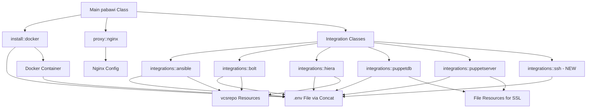

# Design Document: Puppet-Pabawi Refactoring

## Overview

This design document specifies the refactoring of the puppet-pabawi module to introduce a consistent settings hash pattern across all integration classes, add SSH integration support, and properly scope command whitelisting parameters. The refactoring improves configuration flexibility by clearly separating Pabawi application configuration (written to .env file) from Puppet infrastructure management (package installation, file deployment, git repository cloning).

### Goals

1. Introduce a consistent `settings` hash parameter pattern across all integration classes
2. Add SSH integration support for remote command execution
3. Move command whitelist parameters from bolt.pp to docker.pp and nginx.pp where they are actually used
4. Maintain backward compatibility where possible through parameter defaults
5. Improve code maintainability and configuration clarity

### Non-Goals

1. Changing the underlying Pabawi application behavior
2. Modifying the .env file format or structure
3. Altering existing concat fragment ordering
4. Changing how the main pabawi class orchestrates integrations

## Architecture

### Settings Hash Pattern

The refactoring introduces a two-tier parameter structure:

**Settings Hash (Application Configuration)**

- Contains key-value pairs written to the .env file
- Flexible schema - accepts any keys the Pabawi application understands
- Values are transformed based on type (Arrays → JSON, Booleans → lowercase strings, etc.)
- Prefixed with integration name when written to .env (e.g., `ANSIBLE_`, `BOLT_`)

**Regular Class Parameters (Puppet Management)**

- Handle infrastructure concerns: package installation, file deployment, git cloning
- Examples: `manage_package`, `inventory_source`, `ssl_ca_source`
- Not written to .env file - used by Puppet resources

### Component Relationships



### Environment File Generation

All integration classes write to `/opt/pabawi/.env` using concat fragments with specific ordering:

- Order 10: Base configuration (docker.pp)
- Order 20: Bolt integration
- Order 21: PuppetDB integration
- Order 22: PuppetServer integration
- Order 23: Hiera integration
- Order 24: Ansible integration
- Order 25: SSH integration (new)

### Command Whitelist Relocation

Command whitelisting moves from bolt.pp to the classes that actually enforce it:

- **docker.pp**: Writes `COMMAND_WHITELIST` and `COMMAND_WHITELIST_ALLOW_ALL` to .env file (used by containerized application)
- **nginx.pp**: Uses command whitelist in nginx configuration context (for request filtering)
- **bolt.pp**: No longer manages command whitelist parameters

## Components and Interfaces

### Integration Class Interface Pattern

All integration classes follow this consistent interface:

```puppet
class pabawi::integrations::<name> (
  Boolean $enabled = true,
  Hash $settings = {},
  Boolean $manage_package = false,
  Optional[String[1]] $<resource>_source = undef,
  # ... additional source parameters as needed
) {
  # Validation
  # Package management (if manage_package)
  # Resource deployment (if *_source provided)
  # Concat fragment for .env file
}
```

### New SSH Integration Class

**File**: `puppet-pabawi/manifests/integrations/ssh.pp`

**Parameters**:

- `enabled` (Boolean, default: true) - Enable SSH integration
- `settings` (Hash, default: {}) - Application configuration for SSH

**Settings Hash Keys** (examples, flexible schema):

- `host` - SSH host to connect to
- `port` - SSH port (default 22)
- `username` - SSH username
- `private_key_path` - Path to SSH private key
- `timeout` - Connection timeout in milliseconds
- `known_hosts_path` - Path to known_hosts file

**Behavior**:

- Writes `SSH_ENABLED=true` when enabled
- Writes all settings hash keys with `SSH_` prefix to .env
- Uses concat fragment order 25

### Refactored Ansible Integration

**File**: `puppet-pabawi/manifests/integrations/ansible.pp`

**Parameters**:

- `enabled` (Boolean, default: true)
- `settings` (Hash, default: {}) - Application configuration
- `manage_package` (Boolean, default: false)
- `inventory_source` (Optional[String[1]]) - Git URL for inventory
- `playbook_source` (Optional[String[1]]) - Git URL for playbooks

**Settings Hash Keys**:

- `inventory_path` - Path where inventory is located
- `playbook_path` - Path where playbooks are located
- `execution_timeout` - Timeout in milliseconds
- `config` - Path to ansible.cfg

**Behavior**:

- When `inventory_source` provided: clones to `settings['inventory_path']`
- When `playbook_source` provided: clones to `settings['playbook_path']`
- Writes all settings with `ANSIBLE_` prefix to .env

### Refactored Bolt Integration

**File**: `puppet-pabawi/manifests/integrations/bolt.pp`

**Parameters**:

- `enabled` (Boolean, default: true)
- `settings` (Hash, default: {}) - Application configuration
- `manage_package` (Boolean, default: false)
- `project_path_source` (Optional[String[1]]) - Git URL for bolt project

**Settings Hash Keys**:

- `project_path` - Path to bolt project directory
- `execution_timeout` - Timeout in milliseconds

**Behavior**:

- When `project_path_source` provided: clones to `settings['project_path']`
- Writes all settings with `BOLT_` prefix to .env
- **REMOVES**: `command_whitelist` and `command_whitelist_allow_all` parameters

### Refactored Hiera Integration

**File**: `puppet-pabawi/manifests/integrations/hiera.pp`

**Parameters**:

- `enabled` (Boolean, default: true)
- `settings` (Hash, default: {}) - Application configuration
- `manage_package` (Boolean, default: false)
- `control_repo_source` (Optional[String[1]]) - Git URL for control repo

**Settings Hash Keys**:

- `control_repo_path` - Path to control repository
- `config_path` - Relative path to hiera.yaml
- `environments` - Array of environment names
- `fact_source_prefer_puppetdb` - Boolean for fact source preference
- `fact_source_local_path` - Path to local fact files

**Behavior**:

- When `control_repo_source` provided: clones to `settings['control_repo_path']`
- Writes all settings with `HIERA_` prefix to .env

### Refactored PuppetDB Integration

**File**: `puppet-pabawi/manifests/integrations/puppetdb.pp`

**Parameters**:

- `enabled` (Boolean, default: true)
- `settings` (Hash, default: {}) - Application configuration
- `ssl_ca_source` (Optional[String[1]]) - Source for CA certificate
- `ssl_cert_source` (Optional[String[1]]) - Source for client certificate
- `ssl_key_source` (Optional[String[1]]) - Source for private key

**Settings Hash Keys**:

- `server_url` - PuppetDB server URL
- `port` - PuppetDB port
- `ssl_enabled` - Boolean for SSL usage
- `ssl_ca` - Path to CA certificate
- `ssl_cert` - Path to client certificate
- `ssl_key` - Path to private key
- `ssl_reject_unauthorized` - Boolean for certificate validation

**Behavior**:

- When `ssl_*_source` provided: deploys certificates to paths in `settings['ssl_*']`
- Supports file://, https://, and local path formats for sources
- Writes all settings with `PUPPETDB_` prefix to .env

### Refactored PuppetServer Integration

**File**: `puppet-pabawi/manifests/integrations/puppetserver.pp`

**Parameters**:

- `enabled` (Boolean, default: true)
- `settings` (Hash, default: {}) - Application configuration
- `ssl_ca_source` (Optional[String[1]]) - Source for CA certificate
- `ssl_cert_source` (Optional[String[1]]) - Source for client certificate
- `ssl_key_source` (Optional[String[1]]) - Source for private key

**Settings Hash Keys**:

- `server_url` - Puppet Server URL
- `port` - Puppet Server port
- `ssl_enabled` - Boolean for SSL usage
- `ssl_ca` - Path to CA certificate
- `ssl_cert` - Path to client certificate
- `ssl_key` - Path to private key
- `ssl_reject_unauthorized` - Boolean for certificate validation
- `inactivity_threshold` - Node inactivity threshold in seconds
- `cache_ttl` - Cache TTL in milliseconds
- `circuit_breaker_threshold` - Failure count before circuit opens
- `circuit_breaker_timeout` - Circuit breaker timeout in milliseconds
- `circuit_breaker_reset_timeout` - Circuit breaker reset timeout in milliseconds

**Behavior**:

- When `ssl_*_source` provided: deploys certificates to paths in `settings['ssl_*']`
- Supports file://, https://, and local path formats for sources
- Writes all settings with `PUPPETSERVER_` prefix to .env

### Updated Docker Class

**File**: `puppet-pabawi/manifests/install/docker.pp`

**New Parameters**:

- `command_whitelist` (Array[String[1]], default: []) - Allowed commands
- `command_whitelist_allow_all` (Boolean, default: false) - Bypass whitelist

**Behavior**:

- Writes `COMMAND_WHITELIST` as JSON array to .env
- Writes `COMMAND_WHITELIST_ALLOW_ALL` as boolean to .env
- Maintains existing base configuration fragment (order 10)

### Updated Nginx Class

**File**: `puppet-pabawi/manifests/proxy/nginx.pp`

**New Parameters**:

- `command_whitelist` (Array[String[1]], default: []) - Allowed commands
- `command_whitelist_allow_all` (Boolean, default: false) - Bypass whitelist

**Behavior**:

- Uses command whitelist in nginx configuration template
- Applies whitelist filtering at reverse proxy level

## Data Models

### Settings Hash Structure

The settings hash is flexible and integration-specific. Each integration defines which keys it expects:

```puppet
# Ansible example
$ansible_settings = {
  'inventory_path'     => '/opt/pabawi/ansible/inventory',
  'playbook_path'      => '/opt/pabawi/ansible/playbooks',
  'execution_timeout'  => 300000,
  'config'             => '/etc/ansible/ansible.cfg',
}

# PuppetDB example
$puppetdb_settings = {
  'server_url'                => 'https://puppetdb.example.com',
  'port'                      => 8081,
  'ssl_enabled'               => true,
  'ssl_ca'                    => '/opt/pabawi/certs/ca.pem',
  'ssl_cert'                  => '/opt/pabawi/certs/client.pem',
  'ssl_key'                   => '/opt/pabawi/certs/client-key.pem',
  'ssl_reject_unauthorized'   => true,
}

# SSH example
$ssh_settings = {
  'host'              => 'remote.example.com',
  'port'              => 22,
  'username'          => 'automation',
  'private_key_path'  => '/opt/pabawi/ssh/id_rsa',
  'timeout'           => 30000,
}
```

### Environment Variable Transformation Rules

| Puppet Type | .env Format | Example |
|-------------|-------------|---------|
| String | As-is | `ANSIBLE_CONFIG=/etc/ansible/ansible.cfg` |
| Integer | String representation | `PUPPETDB_PORT=8081` |
| Boolean | Lowercase string | `SSH_ENABLED=true` |
| Array | JSON string | `HIERA_ENVIRONMENTS=["production","development"]` |
| Undef/Empty | 'not-set' | `ANSIBLE_CONFIG=not-set` |

### Git Repository Source Mapping

| Source Parameter | Settings Hash Key | Purpose |
|------------------|-------------------|---------|
| `inventory_source` | `inventory_path` | Ansible inventory clone destination |
| `playbook_source` | `playbook_path` | Ansible playbooks clone destination |
| `project_path_source` | `project_path` | Bolt project clone destination |
| `control_repo_source` | `control_repo_path` | Hiera control repo clone destination |

### SSL Certificate Source Mapping

| Source Parameter | Settings Hash Key | Purpose |
|------------------|-------------------|---------|
| `ssl_ca_source` | `ssl_ca` | CA certificate deployment destination |
| `ssl_cert_source` | `ssl_cert` | Client certificate deployment destination |
| `ssl_key_source` | `ssl_key` | Private key deployment destination |

## Correctness Properties

*A property is a characteristic or behavior that should hold true across all valid executions of a system-essentially, a formal statement about what the system should do. Properties serve as the bridge between human-readable specifications and machine-verifiable correctness guarantees.*

### Property 1: Settings Hash to Environment Variable Transformation

*For any* integration class and any settings hash key-value pair, when the integration writes to the .env file, the value SHALL be transformed according to its type: Arrays to JSON format, Booleans to lowercase strings (true/false), Strings as-is, Integers to string representation, and undef/empty values to 'not-set'.

**Validates: Requirements 9.1, 9.2, 9.3, 9.4, 9.5, 2.6, 2.7**

### Property 2: Settings Hash Prefix Application

*For any* integration class and any key-value pair in its settings hash, when written to the .env file, the key SHALL be prefixed with the uppercase integration name followed by an underscore (e.g., ANSIBLE_, BOLT_, SSH_, HIERA_, PUPPETDB_, PUPPETSERVER_).

**Validates: Requirements 1.5, 3.9, 4.7, 5.7, 6.9, 7.9**

### Property 3: Git Repository Cloning with Source Parameters

*For any* integration class with a source parameter (inventory_source, playbook_source, project_path_source, control_repo_source) containing a git URL, the class SHALL create a vcsrepo resource that clones to the path specified in the corresponding settings hash key (inventory_path, playbook_path, project_path, control_repo_path), with ensure => present, and SHALL create the parent directory before cloning.

**Validates: Requirements 3.7, 3.8, 4.6, 5.6, 10.1, 10.2, 10.3, 10.4**

### Property 4: Git Repository Resource Dependencies

*For any* vcsrepo resource created by an integration class, the resource SHALL have a require relationship to the exec resource that creates its parent directory.

**Validates: Requirements 10.5**

### Property 5: SSL Certificate Deployment

*For any* integration class (PuppetDB or PuppetServer) with ssl_ca_source, ssl_cert_source, or ssl_key_source parameters provided, the class SHALL deploy the certificate files to the paths specified in the settings hash (ssl_ca, ssl_cert, ssl_key), and SHALL support file://, https://, and local path formats for source parameters.

**Validates: Requirements 6.7, 6.8, 7.7, 7.8**

### Property 6: SSL Certificate File Permissions

*For any* SSL certificate file deployed by an integration class, the file SHALL have mode 0644 for CA and certificate files, and mode 0600 for private key files.

**Validates: Requirements 6.7, 7.7** (implicit security requirement)

### Property 7: Settings Validation with Descriptive Errors

*For any* integration class that is enabled and has required settings missing from the settings hash, the class SHALL fail with an error message that specifies both the required setting key name and the integration class name that generated the error, and this validation SHALL occur before any resources are created.

**Validates: Requirements 8.1, 8.2, 8.3, 8.4**

### Property 8: Enabled Integration Environment Variable

*For any* integration class where the enabled parameter is true, the class SHALL write an environment variable {INTEGRATION}_ENABLED=true to the .env file (e.g., SSH_ENABLED=true, ANSIBLE_ENABLED=true).

**Validates: Requirements 1.4**

### Property 9: Concat Fragment Ordering Consistency

*For any* integration class, the concat fragment used to write to the .env file SHALL use the assigned order number: Bolt (20), PuppetDB (21), PuppetServer (22), Hiera (23), Ansible (24), SSH (25).

**Validates: Requirements 1.6, 3.10, 4.8, 5.8, 6.10, 7.10**

## Error Handling

### Validation Errors

All integration classes perform parameter validation at the start of execution, before creating any resources:

1. **Required Settings Validation**: When an integration is enabled, required settings must be present in the settings hash
2. **Source-Path Consistency**: When a *_source parameter is provided, the corresponding path key must exist in the settings hash
3. **SSL Configuration Validation**: When SSL is enabled, all three SSL source parameters (ca, cert, key) should be provided together

### Error Message Format

Error messages follow this pattern:

```
pabawi::integrations::{integration_name}: {setting_key} is required when enabled is true
```

Example:

```
pabawi::integrations::ansible: settings['inventory_path'] is required when enabled is true
```

### Git Repository Cloning Errors

When git repository cloning fails:

- vcsrepo resource will fail with standard Puppet error
- Parent directory creation failures will prevent vcsrepo execution
- Invalid git URLs will cause vcsrepo provider errors

### SSL Certificate Deployment Errors

When SSL certificate deployment fails:

- file:// URLs: Puppet will fail if source file doesn't exist
- https:// URLs: curl exec will fail if download fails
- Local paths: Puppet will fail if source file doesn't exist
- Invalid paths in settings hash will cause file resource failures

### Type Transformation Errors

The settings hash accepts any value types, but unexpected types may cause issues:

- Hash values: Not explicitly handled, may cause concat fragment errors
- Complex nested structures: May not serialize correctly to .env format
- Recommendation: Use only String, Integer, Boolean, and Array types in settings hash

## Testing Strategy

### Dual Testing Approach

This refactoring requires both unit tests and property-based tests to ensure correctness:

**Unit Tests** focus on:

- Specific examples of integration configurations
- Edge cases (empty settings hash, missing required settings)
- Error conditions (invalid git URLs, missing SSL certificates)
- Integration points between classes and concat fragments
- Specific concat fragment order values
- Parameter interface validation (correct types, defaults)

**Property-Based Tests** focus on:

- Universal transformation rules (type-based value conversion)
- Settings hash prefix application across all integrations
- Git repository cloning behavior with various URLs and paths
- SSL certificate deployment with different source formats
- Validation error messages with various missing settings

### Property-Based Testing Configuration

We will use **rspec-puppet** with **rspec-puppet-facts** for property-based testing of Puppet code. While not a traditional PBT library, we can use parameterized tests with multiple fact sets and input combinations.

**Test Configuration**:

- Minimum 100 iterations per property test (achieved through parameterized test cases)
- Each property test references its design document property
- Tag format: `# Feature: puppet-pabawi-refactoring, Property {number}: {property_text}`

**Example Property Test Structure**:

```ruby
# Feature: puppet-pabawi-refactoring, Property 1: Settings Hash to Environment Variable Transformation
describe 'pabawi::integrations::ansible' do
  [
    { input: ['cmd1', 'cmd2'], expected: '["cmd1","cmd2"]' },
    { input: true, expected: 'true' },
    { input: false, expected: 'false' },
    { input: 'string_value', expected: 'string_value' },
    { input: 12345, expected: '12345' },
    { input: nil, expected: 'not-set' },
  ].each do |test_case|
    context "with settings value #{test_case[:input].inspect}" do
      let(:params) do
        { settings: { 'test_key' => test_case[:input] } }
      end
      
      it 'transforms value correctly in concat fragment' do
        is_expected.to contain_concat__fragment('pabawi_env_ansible')
          .with_content(/ANSIBLE_TEST_KEY=#{Regexp.escape(test_case[:expected])}/)
      end
    end
  end
end
```

### Unit Test Coverage Areas

1. **SSH Integration Class**:
   - Class exists and is properly defined
   - Accepts settings hash parameter
   - Accepts enabled parameter with default true
   - Writes SSH_ENABLED to .env when enabled
   - Uses concat fragment order 25
   - Writes settings with SSH_ prefix

2. **Command Whitelist Relocation**:
   - bolt.pp does not have command_whitelist parameters
   - docker.pp accepts command_whitelist and command_whitelist_allow_all
   - nginx.pp accepts command_whitelist and command_whitelist_allow_all
   - docker.pp writes COMMAND_WHITELIST as JSON array
   - docker.pp writes COMMAND_WHITELIST_ALLOW_ALL as boolean

3. **Ansible Integration Refactoring**:
   - Accepts settings hash parameter
   - Accepts inventory_source and playbook_source parameters
   - Creates vcsrepo resources when sources provided
   - Writes settings with ANSIBLE_ prefix
   - Uses concat fragment order 24

4. **Bolt Integration Refactoring**:
   - Accepts settings hash parameter
   - Accepts project_path_source parameter
   - Creates vcsrepo resource when source provided
   - Writes settings with BOLT_ prefix
   - Uses concat fragment order 20
   - Does not include command_whitelist parameters

5. **Hiera Integration Refactoring**:
   - Accepts settings hash parameter
   - Accepts control_repo_source parameter
   - Creates vcsrepo resource when source provided
   - Writes settings with HIERA_ prefix
   - Uses concat fragment order 23

6. **PuppetDB Integration Refactoring**:
   - Accepts settings hash parameter
   - Accepts ssl_ca_source, ssl_cert_source, ssl_key_source parameters
   - Deploys SSL certificates when sources provided
   - Supports file://, https://, and local path formats
   - Writes settings with PUPPETDB_ prefix
   - Uses concat fragment order 21

7. **PuppetServer Integration Refactoring**:
   - Accepts settings hash parameter
   - Accepts ssl_ca_source, ssl_cert_source, ssl_key_source parameters
   - Deploys SSL certificates when sources provided
   - Supports file://, https://, and local path formats
   - Writes settings with PUPPETSERVER_ prefix
   - Uses concat fragment order 22

### Integration Testing

Integration tests should verify:

- Complete .env file generation with multiple integrations enabled
- Concat fragment ordering produces correct file structure
- Docker container receives correct .env file
- Git repositories are cloned to correct locations
- SSL certificates are deployed with correct permissions
- Command whitelist is properly passed to Docker container

### Test Execution

Tests should be run with minimal verbosity:

```bash
# Run all tests
bundle exec rake spec

# Run specific integration tests
bundle exec rspec spec/classes/integrations/ssh_spec.rb

# Run with specific fact sets
SPEC_FACTS_OS=ubuntu-20.04-x86_64 bundle exec rake spec
```

### Backward Compatibility Testing

Since this is a refactoring, we need to ensure backward compatibility:

- Test that existing configurations still work (with deprecation warnings if needed)
- Verify that default values maintain current behavior
- Check that .env file format remains unchanged
- Ensure concat fragment ordering is preserved
