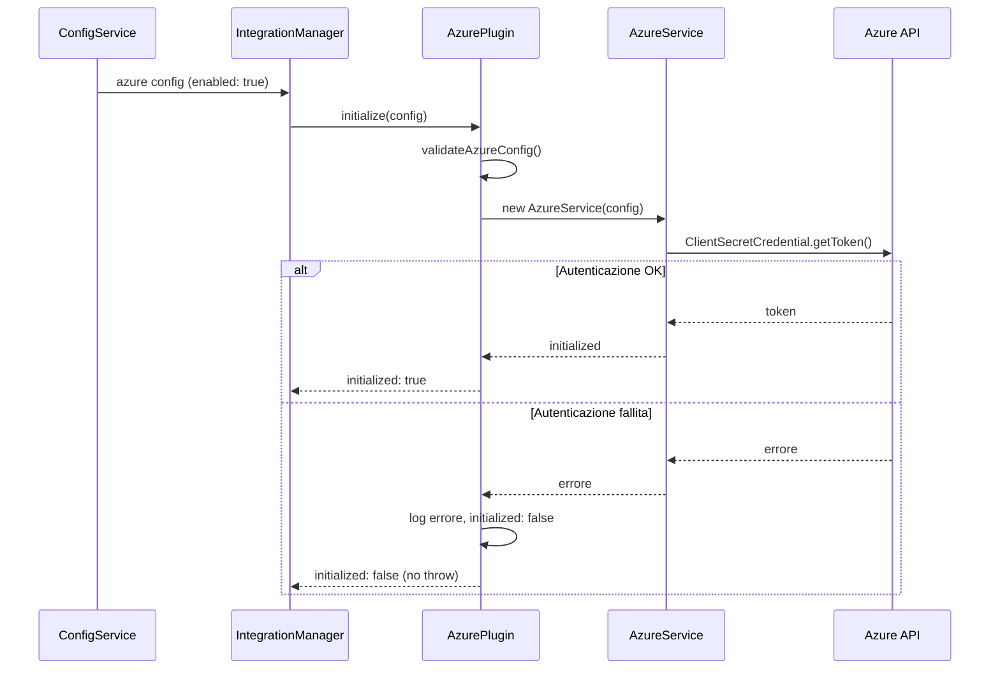
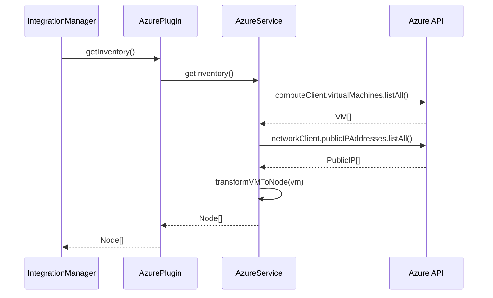
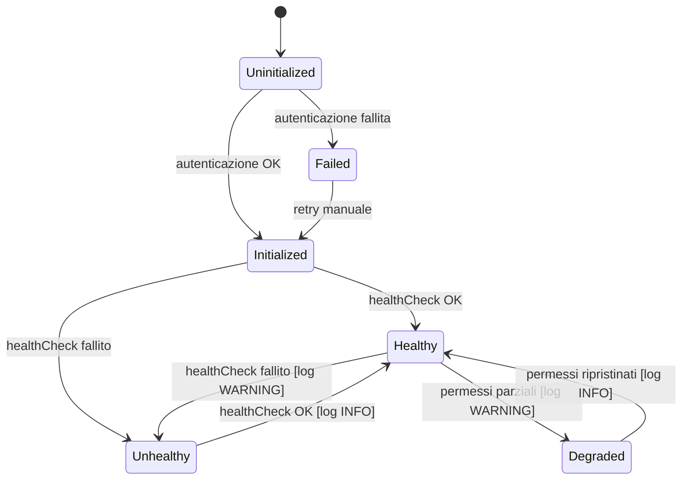

# Documento di Design — Supporto Azure

## Panoramica

Questo documento descrive il design tecnico per l'integrazione di Microsoft Azure in Pabawi. Il plugin Azure seguirà gli stessi pattern architetturali già consolidati nel progetto (AWS, Proxmox), estendendo `BasePlugin` e implementando le interfacce `InformationSourcePlugin` e `ExecutionToolPlugin` per fornire inventario VM, raggruppamento, facts e gestione del ciclo di vita delle macchine virtuali Azure.

L'integrazione utilizza l'Azure SDK per JavaScript (`@azure/arm-compute`, `@azure/arm-network`, `@azure/identity`, `@azure/arm-subscriptions`) per comunicare con le API Azure tramite autenticazione Service Principal.

### Decisioni di design chiave

1. **Pattern Service/Plugin separati**: Come per AWS, la logica Azure SDK è incapsulata in `AzureService` (chiamate API), mentre `AzurePlugin` gestisce il ciclo di vita del plugin e l'integrazione con Pabawi.
2. **Autenticazione Service Principal**: Si utilizza `ClientSecretCredential` da `@azure/identity`, coerente con scenari server-side non interattivi.
3. **Filtri opzionali**: Resource Group e Region sono filtri opzionali applicati a livello di `AzureService` per limitare lo scope dell'inventario.
4. **Degradazione graduale**: Il plugin restituisce dati vuoti in caso di errore, senza interrompere le altre integrazioni, seguendo il pattern di `BasePlugin`.

## Architettura

### Diagramma dei componenti

```mermaid
graph TB
    subgraph Pabawi Backend
        CM[ConfigService] -->|azure config| IM[IntegrationManager]
        IM -->|register| AP[AzurePlugin]
        AP -->|delega| AS[AzureService]
        IM -->|link nodes| NLS[NodeLinkingService]
    end

    subgraph Azure SDK
        AS -->|ClientSecretCredential| AI[@azure/identity]
        AS -->|VM operations| AC[@azure/arm-compute]
        AS -->|Network info| AN[@azure/arm-network]
        AS -->|Subscription info| ASub[@azure/arm-subscriptions]
    end

    subgraph Azure Cloud
        AC -->|REST API| AZ[Azure Resource Manager]
        AN -->|REST API| AZ
        ASub -->|REST API| AZ
        AI -->|OAuth2| AAD[Azure AD / Entra ID]
    end
```

### Flusso di inizializzazione



### Flusso di inventario



## Componenti e Interfacce

### 1. Configurazione Azure nel ConfigService

Estensione del metodo `parseIntegrationsConfig()` in `ConfigService.ts` per includere la configurazione Azure.

```typescript
// Aggiunta al tipo di ritorno di parseIntegrationsConfig()
azure?: {
  enabled: boolean;
  tenantId: string;
  clientId: string;
  clientSecret: string;
  subscriptionId: string;
  resourceGroup?: string;
  region?: string;
  priority?: number;
};
```

**Variabili d'ambiente:**

| Variabile | Obbligatoria | Descrizione |
|---|---|---|
| `AZURE_ENABLED` | Sì | Abilita il plugin (`true`/`false`) |
| `AZURE_TENANT_ID` | Sì (se enabled) | ID del tenant Azure AD |
| `AZURE_CLIENT_ID` | Sì (se enabled) | Client ID del Service Principal |
| `AZURE_CLIENT_SECRET` | Sì (se enabled) | Client Secret del Service Principal |
| `AZURE_SUBSCRIPTION_ID` | Sì (se enabled) | ID della sottoscrizione Azure |
| `AZURE_RESOURCE_GROUP` | No | Filtra per Resource Group |
| `AZURE_REGION` | No | Filtra per regione Azure |
| `AZURE_PRIORITY` | No | Priorità nell'aggregazione inventario |

**Validazione:** Se `AZURE_ENABLED=true`, `AZURE_TENANT_ID` e `AZURE_SUBSCRIPTION_ID` sono obbligatori. L'assenza genera un errore con messaggio specifico.

### 2. AzureService (`backend/src/integrations/azure/AzureService.ts`)

Servizio che incapsula tutte le chiamate all'Azure SDK. Segue lo stesso pattern di `AWSService`.

```typescript
class AzureService {
  constructor(config: AzureConfig, logger: LoggerService);

  // Autenticazione
  async validateCredentials(): Promise<{ subscriptionName: string; subscriptionId: string }>;

  // Inventario
  async getInventory(): Promise<Node[]>;
  async getGroups(): Promise<NodeGroup[]>;
  async getNodeFacts(nodeId: string): Promise<Facts>;
  async getNodeData(nodeId: string, dataType: string): Promise<unknown>;

  // Ciclo di vita VM
  async startVM(resourceGroup: string, vmName: string): Promise<void>;
  async stopVM(resourceGroup: string, vmName: string): Promise<void>;
  async deallocateVM(resourceGroup: string, vmName: string): Promise<void>;
  async restartVM(resourceGroup: string, vmName: string): Promise<void>;
}
```

**Metodi privati chiave:**

- `listAllVMs()`: Elenca le VM, applicando filtri opzionali per Resource Group e Region
- `transformVMToNode(vm, networkInfo)`: Mappa una VM Azure a un oggetto `Node`
- `transformToFacts(nodeId, vm, networkInfo)`: Mappa una VM Azure a un oggetto `Facts`
- `resolveVMIPAddress(vm)`: Risolve l'IP privato/pubblico di una VM tramite le interfacce di rete
- `groupByResourceGroup(nodes)`: Raggruppa i nodi per Resource Group
- `groupByRegion(nodes)`: Raggruppa i nodi per regione
- `groupByTags(nodes)`: Raggruppa i nodi per tag Azure
- `parseNodeId(nodeId)`: Estrae resourceGroup e vmName da un nodeId formato `azure:<resourceGroup>:<vmName>`

### 3. AzurePlugin (`backend/src/integrations/azure/AzurePlugin.ts`)

Plugin che estende `BasePlugin` e implementa `InformationSourcePlugin` e `ExecutionToolPlugin`.

```typescript
class AzurePlugin extends BasePlugin implements InformationSourcePlugin, ExecutionToolPlugin {
  type: "both" = "both";

  constructor(logger?: LoggerService, performanceMonitor?: PerformanceMonitorService);

  // BasePlugin
  protected performInitialization(): Promise<void>;
  protected performHealthCheck(): Promise<Omit<HealthStatus, "lastCheck">>;

  // InformationSourcePlugin
  async getInventory(): Promise<Node[]>;
  async getGroups(): Promise<NodeGroup[]>;
  async getNodeFacts(nodeId: string): Promise<Facts>;
  async getNodeData(nodeId: string, dataType: string): Promise<unknown>;

  // ExecutionToolPlugin
  async executeAction(action: Action): Promise<ExecutionResult>;
  listCapabilities(): Capability[];
}
```

**Comportamento di degradazione:**

- Se `initialized === false`, `getInventory()` e `getGroups()` restituiscono `[]`
- Se l'API Azure fallisce durante una query, il plugin logga l'errore e restituisce dati vuoti
- Le transizioni di stato `healthy: true ↔ false` vengono loggate con livello appropriato (warning/info)

### 4. Tipi Azure (`backend/src/integrations/azure/types.ts`)

```typescript
export interface AzureConfig {
  tenantId: string;
  clientId: string;
  clientSecret: string;
  subscriptionId: string;
  resourceGroup?: string;
  region?: string;
}

export class AzureAuthenticationError extends Error {
  constructor(message: string) {
    super(message);
    this.name = "AzureAuthenticationError";
  }
}
```

### 5. Integrazione con IntegrationManager

La registrazione del plugin avviene nel punto di bootstrap dell'applicazione (dove vengono registrati gli altri plugin), seguendo lo stesso pattern:

```typescript
if (azureConfig?.enabled) {
  const azurePlugin = new AzurePlugin(logger, performanceMonitor);
  integrationManager.registerPlugin(azurePlugin, {
    enabled: true,
    name: "azure",
    type: "both",
    config: azureConfig,
    priority: azureConfig.priority,
  });
}
```

## Modelli Dati

### Mappatura VM Azure → Node

| Campo Node | Sorgente Azure | Note |
|---|---|---|
| `id` | `azure:<resourceGroup>:<vmName>` | Formato univoco per identificare la VM |
| `name` | `vm.name` | Nome della VM Azure |
| `uri` | IP privato → IP pubblico → `vm.name` | Fallback a catena |
| `transport` | `"ssh"` (Linux) / `"winrm"` (Windows) | Basato su `vm.storageProfile.osDisk.osType` |
| `config` | `{}` | Configurazione di default |
| `source` | `"azure"` | Identificatore sorgente |

### Mappatura VM Azure → Facts

```typescript
{
  nodeId: "azure:<resourceGroup>:<vmName>",
  gatheredAt: "<ISO timestamp>",
  source: "azure",
  facts: {
    vmSize: "Standard_D2s_v3",
    location: "westeurope",
    provisioningState: "Succeeded",
    powerState: "running",
    osType: "Linux",
    osDiskSizeGB: 30,
    privateIpAddress: "10.0.0.4",
    publicIpAddress: "20.1.2.3",
    resourceGroup: "my-rg",
    subscriptionId: "sub-id",
    tags: { env: "production", team: "infra" },
    os: { family: "Linux", name: "Ubuntu", release: { full: "22.04", major: "22" } },
    processors: { count: 2, models: ["Standard_D2s_v3"] },
    memory: { system: { total: "8 GB", available: "N/A" } },
    networking: {
      hostname: "my-vm",
      interfaces: { eth0: { ip: "10.0.0.4", public: "20.1.2.3" } }
    }
  }
}
```

### Formato NodeGroup

| Tipo raggruppamento | Formato `id` | Esempio |
|---|---|---|
| Resource Group | `azure:rg:<nome>` | `azure:rg:my-resource-group` |
| Regione | `azure:region:<regione>` | `azure:region:westeurope` |
| Tag | `azure:tag:<chiave>:<valore>` | `azure:tag:env:production` |

### Formato nodeId

Il `nodeId` per le VM Azure segue il formato: `azure:<resourceGroup>:<vmName>`

Questo formato permette di:

- Identificare univocamente la VM
- Estrarre il Resource Group necessario per le operazioni di ciclo di vita
- Mantenere coerenza con il pattern AWS (`aws:<region>:<instanceId>`)

### Capability del plugin

```typescript
[
  {
    name: "start",
    description: "Avvia una VM Azure",
    parameters: [
      { name: "target", type: "string", required: true, description: "nodeId della VM" }
    ]
  },
  {
    name: "stop",
    description: "Arresta una VM Azure",
    parameters: [
      { name: "target", type: "string", required: true, description: "nodeId della VM" }
    ]
  },
  {
    name: "deallocate",
    description: "Dealloca una VM Azure (rilascia risorse compute)",
    parameters: [
      { name: "target", type: "string", required: true, description: "nodeId della VM" }
    ]
  },
  {
    name: "restart",
    description: "Riavvia una VM Azure",
    parameters: [
      { name: "target", type: "string", required: true, description: "nodeId della VM" }
    ]
  }
]
```

## Proprietà di Correttezza

*Una proprietà è una caratteristica o un comportamento che deve essere vero in tutte le esecuzioni valide di un sistema — essenzialmente, un'affermazione formale su ciò che il sistema deve fare. Le proprietà fungono da ponte tra le specifiche leggibili dall'uomo e le garanzie di correttezza verificabili dalla macchina.*

### Proprietà 1: Round-trip della configurazione Azure

*Per qualsiasi* insieme valido di variabili d'ambiente Azure (con `AZURE_ENABLED=true`, `tenantId`, `clientId`, `clientSecret`, `subscriptionId` obbligatori, e `resourceGroup`, `region`, `priority` opzionali), il parsing tramite `ConfigService.parseIntegrationsConfig()` deve produrre un oggetto `azure` i cui campi corrispondono esattamente ai valori delle variabili d'ambiente originali.

**Valida: Requisiti 1.1, 1.4, 1.5, 1.6**

### Proprietà 2: Configurazione disabilitata esclude Azure

*Per qualsiasi* valore di `AZURE_ENABLED` diverso da `"true"` (incluso `undefined`, `"false"`, stringhe casuali), l'oggetto restituito da `parseIntegrationsConfig()` non deve contenere la chiave `azure`.

**Valida: Requisiti 1.7**

### Proprietà 3: Plugin non operativo restituisce dati vuoti senza eccezioni

*Per qualsiasi* istanza di `AzurePlugin` che si trova nello stato `initialized: false` o `healthy: false`, le chiamate a `getInventory()` e `getGroups()` devono restituire array vuoti, e `getNodeFacts(nodeId)` deve restituire un oggetto `Facts` vuoto, senza lanciare eccezioni, indipendentemente dal `nodeId` fornito.

**Valida: Requisiti 2.5, 7.2**

### Proprietà 4: Mappatura VM → Node preserva source e campi obbligatori

*Per qualsiasi* VM Azure restituita dall'API, la trasformazione in oggetto `Node` deve produrre un nodo con: `source` uguale a `"azure"`, `name` uguale al nome della VM, `id` nel formato `azure:<resourceGroup>:<vmName>`, e `uri` non vuoto (IP privato, IP pubblico, o nome VM come fallback).

**Valida: Requisiti 3.1, 3.2, 9.3**

### Proprietà 5: I filtri di inventario restituiscono solo VM corrispondenti

*Per qualsiasi* insieme di VM Azure e qualsiasi combinazione di filtri attivi (`resourceGroup`, `region`), `getInventory()` deve restituire esclusivamente VM che soddisfano tutti i filtri configurati. Se `resourceGroup` è configurato, ogni VM restituita deve appartenere a quel Resource Group. Se `region` è configurata, ogni VM restituita deve trovarsi in quella regione.

**Valida: Requisiti 3.3, 3.4**

### Proprietà 6: Raggruppamento completo e coerente

*Per qualsiasi* insieme di VM Azure, `getGroups()` deve restituire: un `NodeGroup` per ogni Resource Group distinto (con id `azure:rg:<nome>`), un `NodeGroup` per ogni regione distinta (con id `azure:region:<nome>`), un `NodeGroup` per ogni coppia tag chiave:valore distinta (con id `azure:tag:<chiave>:<valore>`). Ogni `NodeGroup` deve avere `source` uguale a `"azure"`, e ogni nodo deve apparire in esattamente un gruppo per Resource Group e un gruppo per regione.

**Valida: Requisiti 4.1, 4.2, 4.3, 4.4**

### Proprietà 7: Facts contengono tutti i campi richiesti

*Per qualsiasi* VM Azure valida, `getNodeFacts(nodeId)` deve restituire un oggetto `Facts` contenente almeno i campi: `vmSize`, `location`, `provisioningState`, `powerState`, `osType`, `resourceGroup`, `subscriptionId`, e `tags`.

**Valida: Requisiti 5.1**

### Proprietà 8: Coerenza del risultato delle operazioni di ciclo di vita

*Per qualsiasi* operazione di ciclo di vita (start, stop, deallocate, restart) su una VM Azure, il campo `success` dell'`ExecutionResult` restituito deve essere `true` se e solo se l'API Azure ha completato l'operazione senza errori. In caso di errore, `success` deve essere `false` e il campo `error` deve contenere il messaggio di errore dell'API.

**Valida: Requisiti 8.5, 8.6**

## Gestione degli Errori

### Strategia generale

Il plugin Azure segue la strategia di degradazione graduale già adottata dagli altri plugin di Pabawi:

1. **Errori di autenticazione**: Catturati durante `performInitialization()`. Il plugin imposta `initialized: false` e logga l'errore. Non viene lanciata alcuna eccezione verso l'`IntegrationManager`.

2. **Errori API durante le query**: Catturati in ogni metodo pubblico (`getInventory`, `getGroups`, `getNodeFacts`, `getNodeData`). Il plugin logga l'errore e restituisce dati vuoti (array vuoto o Facts vuoto).

3. **Errori durante le operazioni di ciclo di vita**: Catturati in `executeAction()`. Il plugin restituisce un `ExecutionResult` con `success: false` e il messaggio di errore.

4. **Errori di configurazione**: Lanciati durante il parsing in `ConfigService` (campi obbligatori mancanti). Questi errori impediscono l'avvio dell'applicazione, coerentemente con il comportamento degli altri plugin.

### Classificazione degli errori

| Tipo errore | Classe | Comportamento |
|---|---|---|
| Credenziali non valide/scadute | `AzureAuthenticationError` | `initialized: false`, log error |
| API non raggiungibile | `Error` (generico) | Dati vuoti, log error |
| VM non trovata | N/A | Facts vuoto, log warning |
| Permessi insufficienti | `AzureAuthenticationError` | `degraded: true`, log warning |
| Timeout API | `Error` (generico) | Dati vuoti, log error |
| Config mancante | `Error` | Throw durante startup |

### Transizioni di stato e logging



## Strategia di Testing

### Approccio duale

Il testing del plugin Azure utilizza un approccio duale complementare:

- **Test unitari (Vitest)**: Verificano esempi specifici, edge case e condizioni di errore con mock delle API Azure
- **Test property-based (fast-check + Vitest)**: Verificano proprietà universali su input generati casualmente

### Libreria di property-based testing

Si utilizza `fast-check` (già presente nel progetto) integrato con Vitest. Ogni test property-based deve:

- Eseguire almeno 100 iterazioni (`numRuns: 100`)
- Referenziare la proprietà del design document tramite commento tag
- Formato tag: `Feature: azure-support, Property {numero}: {titolo}`

### Test unitari

I test unitari coprono:

1. **Configurazione** (Requisiti 1.x):
   - Parsing corretto con tutte le variabili obbligatorie
   - Errore con `AZURE_TENANT_ID` mancante (messaggio specifico)
   - Errore con `AZURE_SUBSCRIPTION_ID` mancante (messaggio specifico)
   - Esclusione config quando `AZURE_ENABLED` non è `true`

2. **Inizializzazione** (Requisiti 2.x):
   - Registrazione come tipo `"both"`
   - Autenticazione con Service Principal (mock)
   - Stato `initialized: true` dopo autenticazione riuscita
   - Stato `initialized: false` dopo autenticazione fallita, senza throw

3. **Health check** (Requisiti 6.x):
   - `healthy: true` con nome Subscription quando connettività OK
   - `healthy: false` con messaggio errore per credenziali non valide
   - `healthy: false` con messaggio connettività per API non raggiungibili
   - `degraded: true` con capabilities per permessi parziali

4. **Degradazione** (Requisiti 7.x):
   - Log warning su transizione healthy→unhealthy
   - Log info su transizione unhealthy→healthy

5. **Ciclo di vita VM** (Requisiti 8.x):
   - Azioni start, stop, deallocate, restart (mock API)
   - `listCapabilities()` restituisce le 4 azioni

6. **Dettagli VM** (Requisiti 5.x):
   - `getNodeData(nodeId, "status")` restituisce stato esecuzione
   - `getNodeData(nodeId, "network")` restituisce info rete
   - `getNodeFacts(nodeId)` con nodeId non valido restituisce Facts vuoto

### Test property-based

Ogni proprietà del design document è implementata da un singolo test property-based:

| Proprietà | Generatore | Verifica |
|---|---|---|
| 1: Round-trip config | `fc.record({tenantId: fc.uuid(), ...})` | Parsing env → oggetto config equivalente |
| 2: Config disabilitata | `fc.string().filter(s => s !== "true")` | `azure` assente dall'oggetto integrazioni |
| 3: Plugin non operativo | `fc.string()` (nodeId casuali) | Array vuoti, nessuna eccezione |
| 4: Mappatura VM→Node | `fc.record({name, resourceGroup, ...})` | `source="azure"`, `id` formato corretto, `uri` non vuoto |
| 5: Filtri inventario | `fc.array(vmArbitrary)` + filtri | Solo VM corrispondenti ai filtri |
| 6: Raggruppamento | `fc.array(vmArbitrary)` | Gruppi per RG, regione, tag completi e coerenti |
| 7: Facts completi | `fc.record({vmSize, location, ...})` | Tutti i campi richiesti presenti |
| 8: Risultato ciclo di vita | `fc.constantFrom("start","stop","deallocate","restart")` | `success` coerente con esito API |

### Struttura dei file di test

```
backend/src/integrations/azure/__tests__/
├── AzurePlugin.test.ts          # Test unitari del plugin
├── AzureService.test.ts         # Test unitari del servizio
├── AzurePlugin.property.test.ts # Test property-based
└── AzureConfig.test.ts          # Test configurazione
```

### Dipendenze Azure SDK

```json
{
  "@azure/identity": "^4.x",
  "@azure/arm-compute": "^21.x",
  "@azure/arm-network": "^33.x",
  "@azure/arm-subscriptions": "^5.x"
}
```

Queste dipendenze vengono mockate nei test unitari e property-based per evitare chiamate reali alle API Azure.
