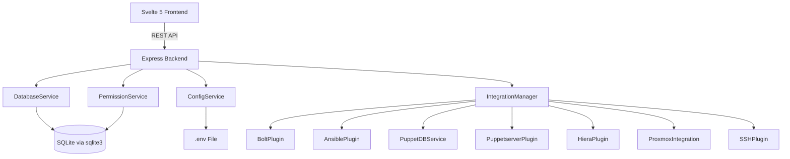
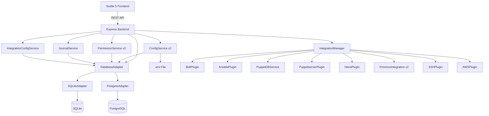
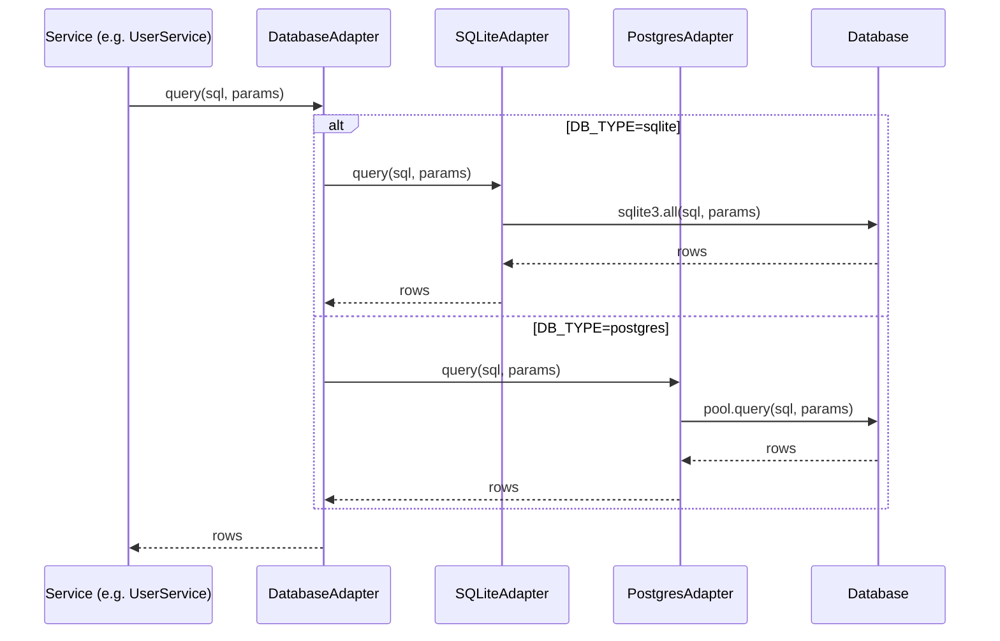
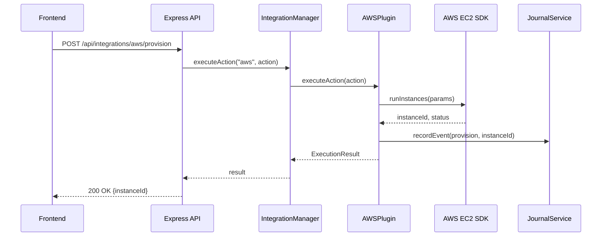
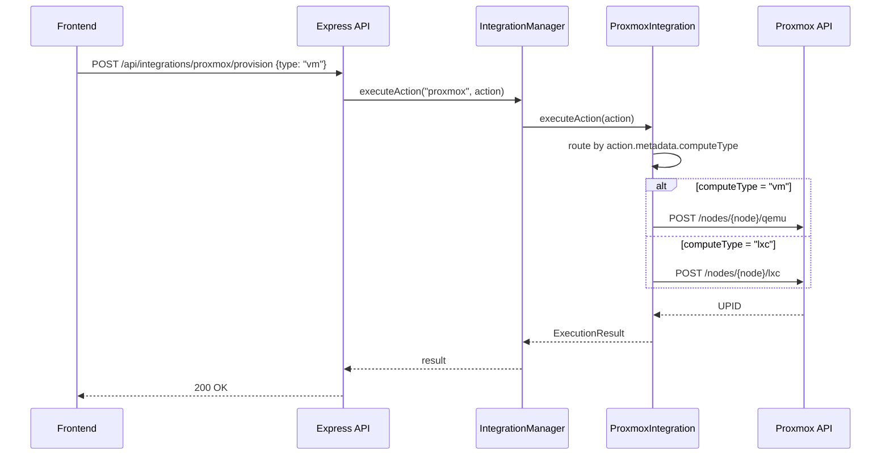
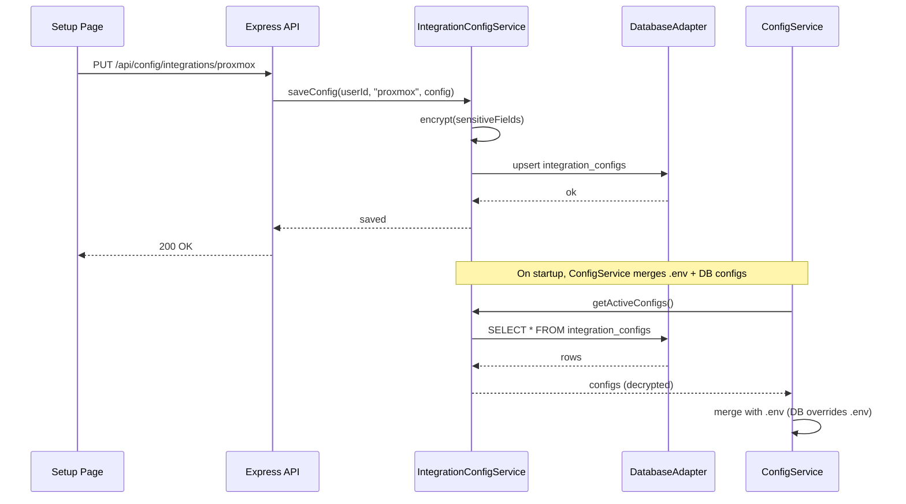
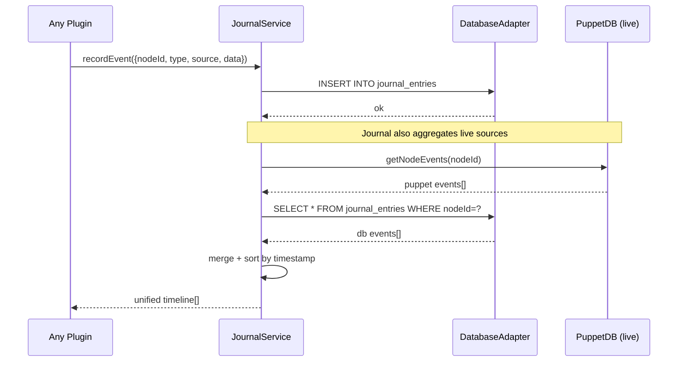
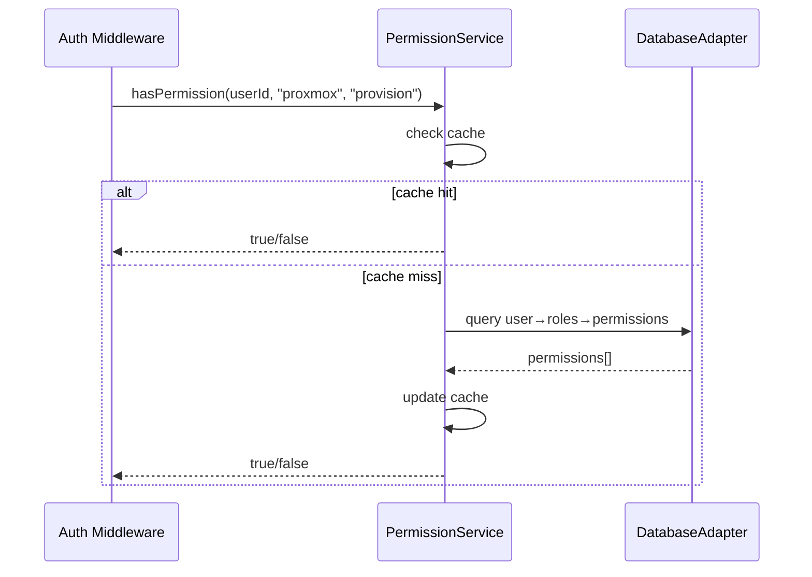

# Design Document: Pabawi Release 1.0.0

## Overview

Pabawi 1.0.0 is a major release introducing six foundational feature areas that transform the application from a single-database, environment-variable-configured tool into a multi-database, plugin-extensible, journal-aware infrastructure management platform. The release covers: (1) full database abstraction to support PostgreSQL alongside SQLite, (2) an AWS plugin with EC2 focus following the existing plugin architecture, (3) improved Proxmox VM/container provisioning UX with clearer separation in the UI while keeping a single plugin, (4) local database storage for integration configurations per user, (5) a nodes journal for tracking provisioning events, lifecycle actions, and manual notes, and (6) improved RBAC with finer-grained permissions per integration activity.

These features are deeply interconnected. The database abstraction layer is foundational — it must be in place before integration configs can be stored in DB, before the journal can persist events, and before new RBAC permissions can be seeded. The AWS plugin and Proxmox improvements extend the plugin architecture. The journal consumes events from all integrations. The improved RBAC gates access to all new and existing features.

Each cloud/hypervisor integration is modeled as a single plugin that handles its own compute types internally. Proxmox remains one plugin managing both VMs and containers (with better internal separation and UI clarity). AWS starts as one plugin focused on EC2, with room to grow into container services (ECS/Fargate) later. This avoids plugin proliferation and keeps the integration model consistent.

The stack remains Svelte 5 + Vite frontend, Node.js + TypeScript + Express backend. TypeScript is used throughout for all code examples and interfaces.

## Architecture

### Current Architecture



### Target Architecture (1.0.0)



## Sequence Diagrams

### Feature 1: Database Abstraction — Query Flow



### Feature 2: AWS Plugin — EC2 Provisioning Flow



### Feature 3: Proxmox VM/Container Provisioning (Single Plugin)



### Feature 4: Integration Config Storage Flow



### Feature 5: Nodes Journal — Event Recording



### Feature 6: Improved RBAC — Permission Check



## Components and Interfaces

### Component 1: DatabaseAdapter (Feature 1)

**Purpose**: Abstract database operations behind a common interface so services are database-agnostic.

```typescript
interface DatabaseAdapter {
  // Core query operations
  query<T>(sql: string, params?: unknown[]): Promise<T[]>;
  queryOne<T>(sql: string, params?: unknown[]): Promise<T | null>;
  execute(sql: string, params?: unknown[]): Promise<{ changes: number }>;
  
  // Transaction support
  beginTransaction(): Promise<void>;
  commit(): Promise<void>;
  rollback(): Promise<void>;
  withTransaction<T>(fn: () => Promise<T>): Promise<T>;
  
  // Connection lifecycle
  initialize(): Promise<void>;
  close(): Promise<void>;
  isConnected(): boolean;
  
  // Migration support
  runMigrations(): Promise<number>;
  getMigrationStatus(): Promise<{ applied: MigrationInfo[]; pending: MigrationInfo[] }>;
  
  // Dialect helpers
  getDialect(): "sqlite" | "postgres";
  getPlaceholder(index: number): string; // Returns '?' for SQLite, '$N' for Postgres
}
```

**Responsibilities**:

- Provide a unified query interface for all services
- Handle parameter placeholder differences (`?` vs `$1`)
- Manage connection pooling (Postgres) or single connection (SQLite)
- Run dialect-aware migrations
- Provide transaction support with automatic rollback on error

### Component 2: AWSPlugin (Feature 2)

**Purpose**: Integrate AWS EC2 into Pabawi following the existing plugin architecture.

```typescript
class AWSPlugin extends BasePlugin implements ExecutionToolPlugin, InformationSourcePlugin {
  readonly type = "both" as const;
  
  // InformationSourcePlugin
  getInventory(): Promise<Node[]>;           // List EC2 instances as nodes
  getGroups(): Promise<NodeGroup[]>;          // Group by region, VPC, tags
  getNodeFacts(nodeId: string): Promise<Facts>; // Instance metadata as facts
  getNodeData(nodeId: string, dataType: string): Promise<unknown>;
  
  // ExecutionToolPlugin
  executeAction(action: Action): Promise<ExecutionResult>;
  listCapabilities(): Capability[];
  listProvisioningCapabilities(): ProvisioningCapability[];
  
  // AWS-specific
  getRegions(): Promise<string[]>;
  getInstanceTypes(region?: string): Promise<InstanceTypeInfo[]>;
  getAMIs(region: string, filters?: AMIFilter[]): Promise<AMIInfo[]>;
  getVPCs(region: string): Promise<VPCInfo[]>;
  getSubnets(region: string, vpcId?: string): Promise<SubnetInfo[]>;
  getSecurityGroups(region: string, vpcId?: string): Promise<SecurityGroupInfo[]>;
  getKeyPairs(region: string): Promise<KeyPairInfo[]>;
}
```

**Responsibilities**:

- Discover EC2 instances and present them as inventory nodes
- Execute lifecycle actions (start, stop, reboot, terminate)
- Provision new EC2 instances with configurable parameters
- Group instances by region, VPC, security group, and tags
- Provide instance metadata as node facts

### Component 3: ProxmoxIntegration v2 (Feature 3)

**Purpose**: Enhance the existing ProxmoxIntegration with clearer internal separation between VM and container operations, and improved provisioning UX. Remains a single plugin registered with IntegrationManager.

```typescript
class ProxmoxIntegration extends BasePlugin implements ExecutionToolPlugin, InformationSourcePlugin {
  readonly type = "both" as const;
  private service: ProxmoxService;
  
  // Existing interface (unchanged)
  getInventory(): Promise<Node[]>;           // Returns both VMs and containers
  getGroups(): Promise<NodeGroup[]>;          // Groups by node, status, type (vm/lxc)
  getNodeFacts(nodeId: string): Promise<Facts>;
  executeAction(action: Action): Promise<ExecutionResult>;
  listCapabilities(): Capability[];
  listProvisioningCapabilities(): ProvisioningCapability[];
  
  // Enhanced: compute-type-aware provisioning helpers
  getNodes(): Promise<PVENode[]>;
  getNextVMID(): Promise<number>;
  getISOImages(node: string, storage?: string): Promise<ISOImage[]>;
  getTemplates(node: string, storage?: string): Promise<Template[]>;
  getStorages(node: string, contentType?: string): Promise<Storage[]>;
  getNetworkBridges(node: string, type?: string): Promise<NetworkBridge[]>;
}

// ProxmoxService enhanced with explicit compute type routing
class ProxmoxService {
  // Provisioning with explicit compute type
  createVM(node: string, params: VMCreateParams): Promise<string>;
  createLXC(node: string, params: LXCCreateParams): Promise<string>;
  
  // Inventory with type filtering
  getInventory(computeType?: "qemu" | "lxc"): Promise<ProxmoxGuest[]>;
  
  // Lifecycle actions route internally by guest type
  executeLifecycleAction(node: string, vmid: number, action: string): Promise<string>;
}
```

**Responsibilities**:

- Single plugin registration with IntegrationManager (name: "proxmox")
- Internal routing between VM and container operations based on action metadata or guest type
- Separate provisioning forms in UI for VMs vs containers, but same backend plugin
- Inventory returns all guests with a `computeType` field ("vm" | "lxc") for UI filtering
- Groups include type-based groups (e.g., "Proxmox VMs", "Proxmox Containers")
- Shared authentication, connection pooling, and health checks

### Component 4: IntegrationConfigService (Feature 4)

**Purpose**: Store and retrieve integration configurations in the database, per user.

```typescript
class IntegrationConfigService {
  saveConfig(userId: string, integrationName: string, config: Record<string, unknown>): Promise<void>;
  getConfig(userId: string, integrationName: string): Promise<IntegrationConfigRecord | null>;
  getActiveConfigs(): Promise<IntegrationConfigRecord[]>;
  deleteConfig(userId: string, integrationName: string): Promise<void>;
  listConfigs(userId: string): Promise<IntegrationConfigRecord[]>;
  getEffectiveConfig(integrationName: string): Promise<Record<string, unknown>>;
}

interface IntegrationConfigRecord {
  id: string;
  userId: string;
  integrationName: string;
  config: Record<string, unknown>; // Sensitive fields encrypted at rest
  isActive: boolean;
  createdAt: string;
  updatedAt: string;
}
```

**Responsibilities**:

- CRUD operations for integration configs stored in DB
- Encrypt sensitive fields (tokens, passwords, keys) at rest
- Merge DB configs with .env configs (DB takes precedence when active)
- Per-user config ownership with admin override capability
- Validate configs against integration-specific Zod schemas

### Component 5: JournalService (Feature 5)

**Purpose**: Record and retrieve a unified timeline of events for inventory nodes.

```typescript
class JournalService {
  // Write operations
  recordEvent(entry: CreateJournalEntry): Promise<string>;
  addNote(nodeId: string, userId: string, content: string): Promise<string>;
  
  // Read operations
  getNodeTimeline(nodeId: string, options?: TimelineOptions): Promise<JournalEntry[]>;
  getRecentEvents(options?: RecentEventsOptions): Promise<JournalEntry[]>;
  searchEntries(query: string, options?: SearchOptions): Promise<JournalEntry[]>;
  
  // Live source aggregation
  aggregateTimeline(nodeId: string, options?: TimelineOptions): Promise<JournalEntry[]>;
}

interface JournalEntry {
  id: string;
  nodeId: string;
  nodeUri: string;
  eventType: JournalEventType;
  source: JournalSource;
  action: string;
  summary: string;
  details: Record<string, unknown>;
  userId?: string;
  timestamp: string;
  isLive: boolean; // true = fetched from live source, false = stored in DB
}

type JournalEventType = 
  | "provision" | "destroy" | "start" | "stop" | "reboot" | "suspend" | "resume"
  | "command_execution" | "task_execution" | "puppet_run" | "package_install"
  | "config_change" | "note" | "error" | "warning" | "info";

type JournalSource = "proxmox" | "aws" | "bolt" | "ansible" 
  | "ssh" | "puppetdb" | "user" | "system";
```

**Responsibilities**:

- Persist provisioning events, lifecycle actions, execution results to DB
- Aggregate live events from PuppetDB (reports, events) with stored events
- Support manual user notes attached to nodes
- Provide filtered, paginated timeline views
- Emit events that other services can subscribe to

### Component 6: Improved RBAC (Feature 6)

**Purpose**: Extend the permission model with finer-grained, integration-activity-level permissions.

```typescript
// New permission granularity model
// Current: resource:action (e.g., "proxmox:execute")
// New:     resource:sub_resource:action (e.g., "proxmox_vm:provision:execute")

// New permission resources for 1.0.0
type PermissionResource =
  // Proxmox (single plugin, granular actions)
  | "proxmox"         // Proxmox operations (VMs and containers)
  // AWS
  | "aws"             // AWS operations (EC2 initially, extensible)
  // Journal
  | "journal"         // Journal read/write
  // Integration config
  | "integration_config" // Config management
  // Existing (unchanged)
  | "ansible" | "bolt" | "puppetdb" | "users" | "groups" | "roles";

// New fine-grained actions
type PermissionAction =
  | "read" | "write" | "execute" | "admin"
  // New granular actions
  | "provision"    // Create new resources
  | "destroy"      // Destroy/decommission resources
  | "lifecycle"    // Start/stop/reboot/suspend/resume
  | "configure"    // Modify integration settings
  | "note"         // Add journal notes
  | "export";      // Export data

// New built-in roles
interface BuiltInRoles {
  Viewer: Permission[];       // read on all resources
  Operator: Permission[];     // read + execute + lifecycle on all
  Provisioner: Permission[];  // NEW: read + provision + destroy + lifecycle on infra
  Administrator: Permission[]; // all permissions
}
```

**Responsibilities**:

- Extend permissions table with new resource:action pairs
- Add new built-in "Provisioner" role
- Seed new permissions via migration
- Update PermissionService to handle new granularity
- Update auth middleware to check new permission types
- Provide UI for managing granular role-permission assignments

## Data Models

### Database Abstraction Tables (Feature 1)

No new tables — this feature changes how existing tables are accessed. The `DatabaseAdapter` interface replaces direct `sqlite3.Database` usage.

**Migration Strategy**:

- All existing `.sql` migrations remain as-is (SQLite dialect)
- New migration files are created in pairs: `NNN_name.sqlite.sql` and `NNN_name.postgres.sql`
- MigrationRunner selects the correct dialect file based on `DatabaseAdapter.getDialect()`
- For shared SQL (no dialect differences), a single `NNN_name.sql` file works for both

### Integration Configs Table (Feature 4)

```sql
CREATE TABLE integration_configs (
  id TEXT PRIMARY KEY,
  userId TEXT NOT NULL,
  integrationName TEXT NOT NULL,
  config TEXT NOT NULL,          -- JSON, sensitive fields encrypted
  isActive INTEGER NOT NULL DEFAULT 1,
  createdAt TEXT NOT NULL,
  updatedAt TEXT NOT NULL,
  FOREIGN KEY (userId) REFERENCES users(id) ON DELETE CASCADE,
  UNIQUE(userId, integrationName)
);

CREATE INDEX idx_integration_configs_user ON integration_configs(userId);
CREATE INDEX idx_integration_configs_name ON integration_configs(integrationName);
CREATE INDEX idx_integration_configs_active ON integration_configs(isActive);
```

**Validation Rules**:

- `integrationName` must match a registered plugin name
- `config` JSON must validate against the integration's Zod schema
- Sensitive fields (matching patterns: `*token*`, `*password*`, `*secret*`, `*key*`) are encrypted with AES-256-GCM before storage
- One active config per integration per user (UNIQUE constraint)

### Journal Entries Table (Feature 5)

```sql
CREATE TABLE journal_entries (
  id TEXT PRIMARY KEY,
  nodeId TEXT NOT NULL,
  nodeUri TEXT NOT NULL,
  eventType TEXT NOT NULL,
  source TEXT NOT NULL,
  action TEXT NOT NULL,
  summary TEXT NOT NULL,
  details TEXT,                  -- JSON
  userId TEXT,
  timestamp TEXT NOT NULL,
  FOREIGN KEY (userId) REFERENCES users(id) ON DELETE SET NULL
);

CREATE INDEX idx_journal_node ON journal_entries(nodeId);
CREATE INDEX idx_journal_timestamp ON journal_entries(timestamp DESC);
CREATE INDEX idx_journal_type ON journal_entries(eventType);
CREATE INDEX idx_journal_source ON journal_entries(source);
CREATE INDEX idx_journal_node_time ON journal_entries(nodeId, timestamp DESC);
```

**Validation Rules**:

- `eventType` must be one of the defined `JournalEventType` values
- `source` must be one of the defined `JournalSource` values
- `timestamp` must be ISO 8601 format
- `details` must be valid JSON if provided
- `nodeUri` follows the existing format: `{source}:{identifier}`

### New Permissions Seed Data (Feature 6)

```sql
-- Proxmox permissions (enhanced granularity, single plugin)
INSERT INTO permissions (id, resource, "action", description, createdAt) VALUES
  ('proxmox-read-001', 'proxmox', 'read', 'View Proxmox VMs and containers', datetime('now')),
  ('proxmox-lifecycle-001', 'proxmox', 'lifecycle', 'Start/stop/reboot VMs and containers', datetime('now')),
  ('proxmox-provision-001', 'proxmox', 'provision', 'Create new VMs and containers', datetime('now')),
  ('proxmox-destroy-001', 'proxmox', 'destroy', 'Destroy/decommission VMs and containers', datetime('now')),
  ('proxmox-admin-001', 'proxmox', 'admin', 'Full Proxmox management', datetime('now'));

-- AWS permissions (single plugin, EC2 initially)
INSERT INTO permissions (id, resource, "action", description, createdAt) VALUES
  ('aws-read-001', 'aws', 'read', 'View AWS resources', datetime('now')),
  ('aws-lifecycle-001', 'aws', 'lifecycle', 'Start/stop/reboot AWS instances', datetime('now')),
  ('aws-provision-001', 'aws', 'provision', 'Launch new AWS resources', datetime('now')),
  ('aws-destroy-001', 'aws', 'destroy', 'Terminate AWS resources', datetime('now')),
  ('aws-admin-001', 'aws', 'admin', 'Full AWS management', datetime('now'));

-- Journal permissions
INSERT INTO permissions (id, resource, "action", description, createdAt) VALUES
  ('journal-read-001', 'journal', 'read', 'View journal entries', datetime('now')),
  ('journal-note-001', 'journal', 'note', 'Add manual notes', datetime('now')),
  ('journal-admin-001', 'journal', 'admin', 'Manage journal entries', datetime('now'));

-- Integration config permissions
INSERT INTO permissions (id, resource, "action", description, createdAt) VALUES
  ('integration_config-read-001', 'integration_config', 'read', 'View integration configs', datetime('now')),
  ('integration_config-configure-001', 'integration_config', 'configure', 'Modify integration configs', datetime('now')),
  ('integration_config-admin-001', 'integration_config', 'admin', 'Full config management', datetime('now'));

-- New Provisioner role
INSERT INTO roles (id, name, description, isBuiltIn, createdAt, updatedAt) VALUES
  ('role-provisioner-001', 'Provisioner', 'Provision and manage infrastructure resources', 1, datetime('now'), datetime('now'));
```

## Key Functions with Formal Specifications

### Function 1: DatabaseAdapter.query()

```typescript
async query<T>(sql: string, params?: unknown[]): Promise<T[]>
```

**Preconditions:**

- `sql` is a non-empty string containing valid SQL for the active dialect
- `params` array length matches the number of placeholders in `sql`
- Adapter is initialized (`isConnected() === true`)

**Postconditions:**

- Returns array of typed rows (may be empty)
- No mutations to input parameters
- Connection remains valid after call
- If SQL is invalid, throws `DatabaseQueryError` with dialect-specific message

**Loop Invariants:** N/A

### Function 2: DatabaseAdapter.withTransaction()

```typescript
async withTransaction<T>(fn: () => Promise<T>): Promise<T>
```

**Preconditions:**

- Adapter is initialized and connected
- No nested transaction is already active (SQLite limitation)

**Postconditions:**

- If `fn` resolves: transaction is committed, returns `fn` result
- If `fn` rejects: transaction is rolled back, throws original error
- Database state is consistent regardless of outcome

**Loop Invariants:** N/A

### Function 3: IntegrationConfigService.getEffectiveConfig()

```typescript
async getEffectiveConfig(integrationName: string): Promise<Record<string, unknown>>
```

**Preconditions:**

- `integrationName` is a non-empty string matching a registered plugin
- DatabaseAdapter is initialized

**Postconditions:**

- Returns merged config: `.env` values as base, DB values override when `isActive === true`
- Sensitive fields in returned config are decrypted
- If no DB config exists, returns `.env` config only
- If no `.env` config exists, returns DB config only
- If neither exists, returns empty object

**Loop Invariants:** N/A

### Function 4: JournalService.aggregateTimeline()

```typescript
async aggregateTimeline(nodeId: string, options?: TimelineOptions): Promise<JournalEntry[]>
```

**Preconditions:**

- `nodeId` is a non-empty string
- If `options.startDate` and `options.endDate` provided, `startDate <= endDate`

**Postconditions:**

- Returns merged array of DB-stored events and live-source events
- All entries have `isLive` correctly set (`true` for live-fetched, `false` for DB-stored)
- Result is sorted by `timestamp` descending
- If a live source fails, DB events are still returned (graceful degradation)
- Result respects `options.limit` and `options.offset` if provided

**Loop Invariants:**

- During merge: all processed entries maintain descending timestamp order

### Function 5: AWSPlugin.executeAction()

```typescript
async executeAction(action: Action): Promise<ExecutionResult>
```

**Preconditions:**

- Plugin is initialized (`isInitialized() === true`)
- `action.type` is one of: "command" (lifecycle), "task" (provision/destroy)
- `action.target` is a valid EC2 instance ID or "new" for provisioning
- AWS credentials are valid and have sufficient IAM permissions

**Postconditions:**

- Returns `ExecutionResult` with `status: "success" | "failed"`
- On success: `result.output` contains instance details
- On failure: `result.error` contains descriptive AWS error message
- A journal entry is recorded for the action regardless of outcome
- No partial state: provisioning either completes or is cleaned up

**Loop Invariants:** N/A

## Algorithmic Pseudocode

### Algorithm: Database Adapter Factory

```typescript
function createDatabaseAdapter(config: AppConfig): DatabaseAdapter {
  const dbType = process.env.DB_TYPE ?? "sqlite";
  
  if (dbType === "postgres") {
    const connectionString = process.env.DATABASE_URL;
    assert(connectionString !== undefined, "DATABASE_URL required for postgres");
    return new PostgresAdapter(connectionString);
  }
  
  // Default: SQLite
  const dbPath = config.databasePath;
  return new SQLiteAdapter(dbPath);
}
```

**Preconditions:**

- `config` is a valid AppConfig
- If `DB_TYPE=postgres`, `DATABASE_URL` environment variable is set

**Postconditions:**

- Returns an uninitialized adapter of the correct type
- Caller must call `adapter.initialize()` before use

### Algorithm: Config Merge Strategy

```typescript
function mergeConfigs(
  envConfig: Record<string, unknown>,
  dbConfig: Record<string, unknown> | null
): Record<string, unknown> {
  // Base: environment config
  const result = { ...envConfig };
  
  // If no DB config, return env-only
  if (dbConfig === null) return result;
  
  // DB values override env values (shallow merge)
  for (const [key, value] of Object.entries(dbConfig)) {
    if (value !== null && value !== undefined) {
      result[key] = value;
    }
  }
  
  return result;
}
```

**Preconditions:**

- `envConfig` is a valid config object (may be empty)
- `dbConfig` is either null or a valid config object

**Postconditions:**

- Result contains all keys from envConfig
- For overlapping keys, dbConfig values take precedence (if non-null)
- Neither input is mutated

### Algorithm: Journal Timeline Aggregation

```typescript
async function aggregateTimeline(
  nodeId: string,
  dbAdapter: DatabaseAdapter,
  liveSources: Map<string, InformationSourcePlugin>,
  options?: TimelineOptions
): Promise<JournalEntry[]> {
  // Step 1: Fetch DB-stored events
  const dbEntries = await dbAdapter.query<JournalEntry>(
    "SELECT * FROM journal_entries WHERE nodeId = ? ORDER BY timestamp DESC",
    [nodeId]
  );
  
  // Step 2: Fetch live events from each source (parallel, fault-tolerant)
  const liveEntries: JournalEntry[] = [];
  const livePromises = Array.from(liveSources.entries()).map(
    async ([name, source]) => {
      try {
        if (!source.isInitialized()) return [];
        const events = await source.getNodeData(nodeId, "events");
        if (!Array.isArray(events)) return [];
        return events.map(e => transformToJournalEntry(e, name, true));
      } catch {
        // Graceful degradation: skip failed sources
        return [];
      }
    }
  );
  
  const liveResults = await Promise.all(livePromises);
  for (const entries of liveResults) {
    liveEntries.push(...entries);
  }
  
  // Step 3: Merge and sort
  const allEntries = [...dbEntries.map(e => ({ ...e, isLive: false })), ...liveEntries];
  allEntries.sort((a, b) => b.timestamp.localeCompare(a.timestamp));
  
  // Step 4: Apply pagination
  const offset = options?.offset ?? 0;
  const limit = options?.limit ?? 50;
  return allEntries.slice(offset, offset + limit);
}
```

**Preconditions:**

- `nodeId` is non-empty
- `dbAdapter` is initialized
- `liveSources` may be empty

**Postconditions:**

- Returns merged, sorted, paginated timeline
- DB entries have `isLive: false`, live entries have `isLive: true`
- Failed live sources do not prevent DB entries from being returned

**Loop Invariants:**

- After each live source fetch: `liveEntries` contains only valid JournalEntry objects
- After merge: `allEntries` is sorted by timestamp descending

### Algorithm: Service Migration from sqlite3 to DatabaseAdapter

```typescript
// BEFORE (current pattern in UserService, RoleService, etc.)
class UserService {
  private db: Database; // sqlite3.Database
  
  private runQuery(sql: string, params: unknown[]): Promise<void> {
    return new Promise((resolve, reject) => {
      this.db.run(sql, params, (err) => {
        if (err) reject(err); else resolve();
      });
    });
  }
}

// AFTER (migrated pattern)
class UserService {
  private db: DatabaseAdapter;
  
  async createUser(data: CreateUserDTO): Promise<User> {
    // Placeholder style is handled by adapter
    await this.db.execute(
      "INSERT INTO users (id, username, email, ...) VALUES (?, ?, ?, ...)",
      [userId, data.username, data.email, ...]
    );
    return await this.db.queryOne<User>("SELECT * FROM users WHERE id = ?", [userId]);
  }
}
```

**Migration approach:**

- Replace `private db: Database` with `private db: DatabaseAdapter` in all services
- Replace `runQuery/getQuery/allQuery` helper methods with `db.execute/db.queryOne/db.query`
- The adapter handles placeholder translation internally
- Services affected: UserService, RoleService, GroupService, PermissionService, SetupService, ExecutionRepository, AuthenticationService, AuditLoggingService, BatchExecutionService, PuppetRunHistoryService, ReportFilterService

## Example Usage

### Example 1: Database Adapter initialization

```typescript
// In server.ts startup
import { createDatabaseAdapter } from "./database/AdapterFactory";

const dbAdapter = createDatabaseAdapter(config);
await dbAdapter.initialize();
await dbAdapter.runMigrations();

// Pass adapter to services instead of raw sqlite3.Database
const userService = new UserService(dbAdapter, authService);
const roleService = new RoleService(dbAdapter);
const journalService = new JournalService(dbAdapter);
```

### Example 2: AWS Plugin registration

```typescript
// In IntegrationManager setup
const awsConfig = configService.getAWSConfig();
if (awsConfig?.enabled) {
  const awsPlugin = new AWSPlugin(logger, performanceMonitor);
  integrationManager.registerPlugin(awsPlugin, {
    enabled: true,
    name: "aws",
    type: "both",
    config: awsConfig,
  });
}
```

### Example 3: Proxmox plugin registration (unchanged pattern)

```typescript
// ProxmoxIntegration remains a single plugin — same registration as before
const proxmoxPlugin = new ProxmoxIntegration(logger, performanceMonitor);
integrationManager.registerPlugin(proxmoxPlugin, {
  enabled: true, name: "proxmox", type: "both", config: proxmoxConfig,
});
// Internally, ProxmoxService routes VM vs LXC operations based on guest type
```

### Example 4: Saving integration config from UI

```typescript
// PUT /api/config/integrations/:name
router.put("/:name", authMiddleware, async (req, res) => {
  const { name } = req.params;
  const userId = req.user.id;
  
  // Check permission
  const canConfigure = await permissionService.hasPermission(
    userId, "integration_config", "configure"
  );
  if (!canConfigure) return res.status(403).json({ error: "Forbidden" });
  
  await integrationConfigService.saveConfig(userId, name, req.body);
  res.json({ message: "Configuration saved" });
});
```

### Example 5: Recording a journal event from a plugin

```typescript
// Inside AWSPlugin.executeAction after successful provisioning
const journalEntry: CreateJournalEntry = {
  nodeId: `aws:${instanceId}`,
  nodeUri: `aws:${region}:${instanceId}`,
  eventType: "provision",
  source: "aws",
  action: "runInstances",
  summary: `Provisioned EC2 instance ${instanceId} (${instanceType})`,
  details: { instanceId, instanceType, region, ami, vpcId },
  userId: action.metadata?.userId as string,
};
await this.journalService.recordEvent(journalEntry);
```

### Example 6: Checking granular RBAC permission

```typescript
// Middleware checking if user can provision on Proxmox
const canProvision = await permissionService.hasPermission(
  userId, "proxmox", "provision"
);

// Proxmox plugin handles VM vs LXC internally — permission is at the integration level
if (!canProvision) {
  throw new Error("Insufficient permissions to provision on Proxmox");
}

// AWS uses the same pattern
const canProvisionAWS = await permissionService.hasPermission(
  userId, "aws", "provision"
);
```

## Correctness Properties

*A property is a characteristic or behavior that should hold true across all valid executions of a system — essentially, a formal statement about what the system should do. Properties serve as the bridge between human-readable specifications and machine-verifiable correctness guarantees.*

### Property 1: Database Adapter Query Consistency

*For any* valid SQL query `q` and parameters `p`, executing `SQLiteAdapter.query(q, p)` and `PostgresAdapter.query(q, p)` on identical data sets should return structurally identical result arrays.

**Validates: Requirements 1.6, 1.7**

### Property 2: Placeholder Dialect Correctness

*For any* positive integer N, `SQLiteAdapter.getPlaceholder(N)` should return `"?"` and `PostgresAdapter.getPlaceholder(N)` should return `"$N"`.

**Validates: Requirements 1.5, 2.4, 3.3**

### Property 3: Transaction Atomicity

*For any* set of database mutations wrapped in `withTransaction(fn)`, if `fn` resolves then all mutations are committed and visible, and if `fn` rejects then no mutations are visible. No partial state is observable.

**Validates: Requirements 7.1, 7.2**

### Property 4: Migration Idempotency

*For any* database and set of migration files, running `runMigrations()` multiple times produces the same schema state. Already-applied migrations are skipped on subsequent runs.

**Validates: Requirements 5.4, 5.5**

### Property 5: Migration Dialect Selection

*For any* set of migration files containing dialect-specific variants (`.sqlite.sql`, `.postgres.sql`) and shared files (`.sql`), the MigrationRunner selects only files matching the active adapter's dialect.

**Validates: Requirement 5.3**

### Property 6: Config Merge Determinism

*For any* `.env` config object and database config object, `getEffectiveConfig(name)` returns a merged result where database values override `.env` values for overlapping non-null keys, and all non-overlapping keys from both sources are preserved.

**Validates: Requirements 19.1, 19.2**

### Property 7: Encryption Round-Trip

*For any* string value `v`, `decrypt(encrypt(v)) === v`. Sensitive fields stored in `integration_configs.config` survive the encrypt-store-retrieve-decrypt cycle without data loss.

**Validates: Requirements 18.4, 18.5, 20.3**

### Property 8: Integration Config CRUD Round-Trip

*For any* valid integration config object, saving it via `IntegrationConfigService.saveConfig` and then retrieving it via `getConfig` for the same user and integration name should return an equivalent config (with sensitive fields decrypted).

**Validates: Requirement 18.1**

### Property 9: Sensitive Field Encryption at Rest

*For any* config containing fields matching sensitive patterns (`*token*`, `*password*`, `*secret*`, `*key*`), the raw database value for those fields should not equal the plaintext value after `saveConfig` is called.

**Validates: Requirement 18.4**

### Property 10: Journal Entry Completeness

*For any* completed action (provisioning, lifecycle, or execution) regardless of success or failure, exactly one journal entry is recorded containing nodeId, nodeUri, eventType, source, action, summary, and timestamp.

**Validates: Requirements 10.4, 11.4, 22.1, 22.2, 22.3, 22.4**

### Property 11: Journal Timeline Sort Order

*For any* set of journal entries (both database-stored and live-fetched), `aggregateTimeline(nodeId)` returns entries sorted by timestamp in descending order.

**Validates: Requirement 23.3**

### Property 12: Journal isLive Flag Correctness

*For any* aggregated timeline, entries originating from the database have `isLive === false` and entries fetched from live sources have `isLive === true`.

**Validates: Requirement 23.2**

### Property 13: Journal Pagination Bounds

*For any* timeline aggregation with limit L and offset O, the result contains at most L entries.

**Validates: Requirement 23.5**

### Property 14: Journal Source Validation

*For any* string value not in the set {proxmox, aws, bolt, ansible, ssh, puppetdb, user, system}, attempting to record a journal entry with that source should fail validation. For any value in the set, recording should succeed.

**Validates: Requirements 25.3, 26.3**

### Property 15: Proxmox Compute Type Partition

*For any* Proxmox inventory, every item has a `computeType` field equal to `"vm"` or `"lxc"`. Filtering by `computeType === "vm"` and `computeType === "lxc"` produces disjoint sets whose union equals the full unfiltered inventory.

**Validates: Requirements 14.3, 14.4, 16.1, 16.2, 16.3**

### Property 16: AWS Node Field Completeness

*For any* EC2 instance returned by `AWSPlugin.getInventory()`, the corresponding Node object includes instance state, type, region, VPC, and tags fields.

**Validates: Requirement 9.4**

### Property 17: AWS Instance Grouping Correctness

*For any* set of EC2 instances, `AWSPlugin.getGroups()` produces groups where every instance appears in at least one group (by region, VPC, or tags), and no group contains instances that don't match its grouping criterion.

**Validates: Requirement 9.2**

### Property 18: Plugin Registration Uniqueness

*For any* sequence of plugin registrations, `IntegrationManager` never contains two plugins with the same name. Registering a plugin with a name that already exists throws an error.

**Validates: Requirements 31.1, 31.2**

### Property 19: Permission Monotonicity

*For any* role, adding a permission to that role never removes existing permissions, and removing a permission never adds new ones. The set of permissions only changes by the explicitly added or removed permission.

**Validates: Requirement 29.2**

## Error Handling

### Error Scenario 1: Database Connection Failure

**Condition**: PostgreSQL is unreachable at startup or connection drops during operation
**Response**: `PostgresAdapter.initialize()` throws `DatabaseConnectionError`. During operation, queries throw `DatabaseConnectionError` with retry info.
**Recovery**: Adapter implements connection pool with automatic reconnection. Services receive errors and can retry. Health check reports database as unhealthy.

### Error Scenario 2: AWS Credentials Invalid or Expired

**Condition**: AWS credentials in config are invalid, expired, or lack required IAM permissions
**Response**: `AWSPlugin.performHealthCheck()` returns `{ healthy: false, message: "AWS authentication failed" }`. Actions throw `AWSAuthenticationError`.
**Recovery**: Plugin reports degraded state. User can update credentials via IntegrationConfigService. Health check scheduler will detect recovery.

### Error Scenario 3: Proxmox — Backward Compatibility

**Condition**: Existing Proxmox configs and permissions reference the current `proxmox` resource name
**Response**: No migration needed — the plugin name remains `proxmox`. New granular actions (`provision`, `lifecycle`, `destroy`) are added alongside existing ones (`read`, `execute`, `admin`).
**Recovery**: Existing `proxmox:execute` permission continues to work. New actions are additive. Migration seeds the new action types without removing old ones.

### Error Scenario 4: Encryption Key Rotation

**Condition**: The encryption key for integration configs needs to be rotated
**Response**: `IntegrationConfigService.rotateEncryptionKey(oldKey, newKey)` re-encrypts all stored configs.
**Recovery**: Atomic operation within a transaction. If rotation fails, all configs remain encrypted with the old key.

### Error Scenario 5: Journal Live Source Timeout

**Condition**: PuppetDB or other live source times out when fetching events for journal aggregation
**Response**: `aggregateTimeline()` returns DB-stored events with a warning flag indicating incomplete live data.
**Recovery**: Subsequent requests retry live sources. Cached live data (if available) is used as fallback.

## Testing Strategy

### Unit Testing Approach

- Test each `DatabaseAdapter` implementation independently with in-memory databases
- Test `IntegrationConfigService` encryption/decryption round-trips
- Test `JournalService` merge logic with mock DB and mock live sources
- Test `AWSPlugin` with mocked AWS SDK calls
- Test `ProxmoxIntegration` VM/LXC routing with mocked `ProxmoxService`
- Test new RBAC permissions seeding and permission checks
- Test config merge logic with various `.env` + DB combinations

### Property-Based Testing Approach

**Property Test Library**: fast-check

- **DB Adapter**: For any sequence of insert/query operations, both adapters produce identical results
- **Config Merge**: `merge(env, db)` is idempotent: `merge(merge(env, db), db) === merge(env, db)`
- **Journal Sort**: `aggregateTimeline()` output is always sorted by timestamp descending
- **Permission Check**: `hasPermission` is consistent with `getUserPermissions` — if a permission appears in the user's permission list, `hasPermission` returns true for it
- **Encryption**: For any string input, `decrypt(encrypt(input)) === input`

### Integration Testing Approach

- Test full request flow: API → Service → DatabaseAdapter → actual SQLite/Postgres
- Test plugin registration and initialization with IntegrationManager
- Test journal event recording triggered by actual plugin actions
- Test RBAC permission checks through auth middleware with real DB
- Test config save/load cycle through API endpoints
- Test Proxmox: verify inventory includes both VMs and containers with correct `computeType`

## Performance Considerations

- **Connection Pooling**: PostgresAdapter uses `pg.Pool` with configurable `max` connections (default: 10). SQLiteAdapter uses single connection with WAL mode.
- **Query Caching**: PermissionService already caches permission checks for 5 minutes. This is retained and extended to new permission types.
- **Journal Pagination**: Journal queries use cursor-based pagination on the `(nodeId, timestamp)` composite index to avoid offset-based performance degradation.
- **Live Source Timeouts**: Journal aggregation applies a 5-second timeout per live source to prevent slow sources from blocking the timeline.
- **Inventory Cache**: IntegrationManager's existing inventory cache (5-minute TTL) applies to new plugins (AWS) and enhanced Proxmox.
- **Prepared Statements**: DatabaseAdapter supports prepared statements for frequently-executed queries (permission checks, journal inserts).

## Security Considerations

- **Config Encryption**: Integration configs containing sensitive fields are encrypted with AES-256-GCM using a key derived from `JWT_SECRET` + a per-record salt. The encryption key is never stored in the database.
- **AWS Credentials**: AWS access keys and secret keys are stored encrypted in `integration_configs`. IAM role-based authentication is recommended over static credentials.
- **SQL Injection Prevention**: All queries use parameterized statements through the `DatabaseAdapter` interface. No string concatenation for SQL construction.
- **Permission Escalation Prevention**: Users cannot assign permissions they don't have. Role modification requires `roles:admin` permission. Built-in roles cannot be deleted.
- **Journal Audit Trail**: Journal entries are append-only. Deletion requires `journal:admin` permission and is logged in the audit log.
- **Proxmox Token Security**: Proxmox API tokens stored in DB configs are encrypted. SSL certificate validation warnings are logged.

## Dependencies

### New Dependencies

| Package | Purpose | Feature |
|---------|---------|---------|
| `pg` | PostgreSQL client for Node.js | Feature 1: DB Abstraction |
| `@aws-sdk/client-ec2` | AWS EC2 API client | Feature 2: AWS Plugin |
| `@aws-sdk/client-sts` | AWS STS for credential validation | Feature 2: AWS Plugin |

### Existing Dependencies (Unchanged)

| Package | Purpose |
|---------|---------|
| `sqlite3` | SQLite database driver |
| `express` | HTTP server framework |
| `zod` | Schema validation |
| `jsonwebtoken` | JWT authentication |
| `bcrypt` | Password hashing |
| `dotenv` | Environment variable loading |

### Dependency Notes

- `pg` is the most widely-used PostgreSQL client for Node.js with TypeScript support
- AWS SDK v3 (`@aws-sdk/client-ec2`) uses modular imports to minimize bundle size
- No ORM is introduced — the `DatabaseAdapter` is a thin abstraction, not a query builder
- All new dependencies should be pinned to specific versions in `package.json`
