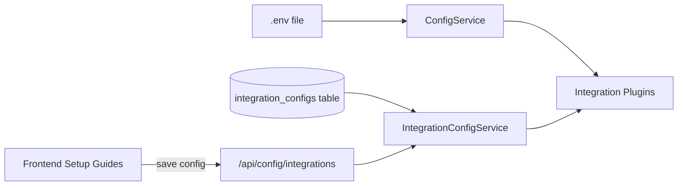
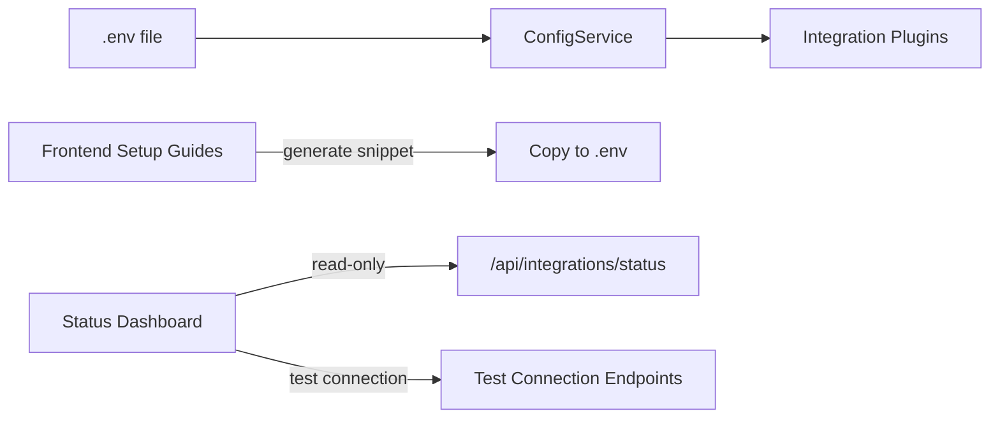
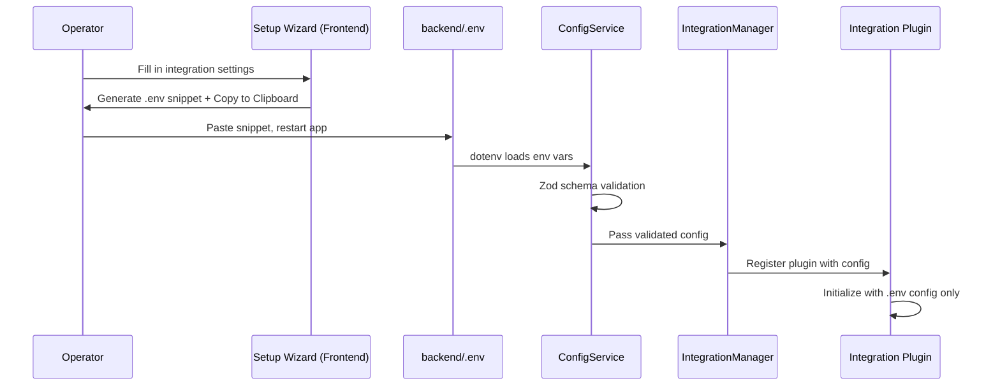

# Design Document — Pabawi v1.0.0 Release Preparation

## Overview

This design covers the refactoring of Pabawi from a dual-config model (`.env` + per-user DB overrides via IntegrationConfigService) to a single-source-of-truth model where `backend/.env` is the only configuration source. The work includes:

1. Removing IntegrationConfigService, its routes, types, DB table, and all references
2. Converting the IntegrationConfigPage from a CRUD UI to a read-only Integration Status Dashboard
3. Converting setup guide components from DB-saving wizards to `.env` snippet generators
4. Removing frontend API functions for integration config CRUD
5. Fixing broken tests, adding new coverage, updating docs, cleaning dead code
6. Bumping version to 1.0.0 across all artifacts
7. Ensuring all pre-commit hooks and Docker configs pass

The refactor simplifies the architecture: `.env` → ConfigService → integration plugins. No database involvement in configuration.

## Architecture

### Before (v0.10.0)



### After (v1.0.0)



### Configuration Flow (v1.0.0)



## Components and Interfaces

### Component 1: Backend Removals

Files to delete:
- `backend/src/services/IntegrationConfigService.ts`
- `backend/src/services/IntegrationConfigService.types.ts`
- `backend/src/routes/integrationConfig.ts`
- `backend/test/services/IntegrationConfigService.test.ts`
- `backend/test/integrationConfig.routes.test.ts`

Code to modify:
- `backend/src/server.ts` — Remove IntegrationConfigService import, instantiation, route registration, and the `getEffectiveConfig` merge in Proxmox/AWS plugin initialization. Plugins receive config directly from ConfigService.

### Component 2: Database Migration (010_drop_integration_configs.sql)

New migration file: `backend/src/database/migrations/010_drop_integration_configs.sql`

```sql
-- Migration 010: Drop integration_configs table
-- Removes per-user integration config storage (v1.0.0 uses .env as single source of truth)
DROP TABLE IF EXISTS integration_configs;
```

The `DROP TABLE IF EXISTS` ensures idempotency — safe to run on fresh databases that never had the table, and on existing databases that do.

### Component 3: Integration Status Dashboard (IntegrationConfigPage.svelte replacement)

The existing `IntegrationConfigPage.svelte` is rewritten as a read-only dashboard.

Interface:
- Fetches from `GET /api/integrations/status` (existing endpoint)
- Displays each integration: name, icon, enabled/disabled, health status (connected/degraded/error)
- Color indicators: green (connected), yellow (degraded), red (error), gray (disabled/not configured)
- "Test Connection" buttons for Proxmox and AWS (calls existing `POST /api/integrations/proxmox/test` and `POST /api/integrations/aws/test` using `.env`-sourced config)
- No form fields, save buttons, delete buttons, or any mutation controls

### Component 4: Env Snippet Wizard (Setup Guide Refactor)

Each setup guide component (ProxmoxSetupGuide, AWSSetupGuide, etc.) is refactored:

Before:
- Form fields → "Save Configuration" button → `saveIntegrationConfig()` API call → DB write
- "Test Connection" button → sends form values to test endpoint

After:
- Form fields → live `.env` snippet preview (already partially exists in some guides)
- "Copy to Clipboard" button copies the full snippet
- Instructions: "Paste into `backend/.env` and restart the application"
- Sensitive values masked in preview (`***`) but full values in clipboard copy
- "Save Configuration" button and all `saveIntegrationConfig`/`getIntegrationConfig` calls removed
- "Test Connection" button removed from setup guides (moved to Status Dashboard)
- `onMount` config loading from DB removed

### Component 5: Frontend API Cleanup (api.ts)

Functions to remove from `frontend/src/lib/api.ts`:
- `saveIntegrationConfig()`
- `getIntegrationConfig()`
- `getIntegrationConfigs()`
- `deleteIntegrationConfig()`
- `saveProxmoxConfig()` (deprecated wrapper)
- `saveAWSConfig()` (deprecated wrapper)
- `IntegrationConfigRecord` type

Functions to keep:
- `testProxmoxConnection()` — but refactored to not send form config; instead calls a no-body endpoint that tests using `.env` config
- `testAWSConnection()` — same refactor

### Component 6: Test Connection Endpoint Refactor

The existing test connection endpoints (`POST /api/integrations/proxmox/test` and `POST /api/integrations/aws/test`) currently accept config in the request body. They need to be refactored to use the `.env`-sourced config from ConfigService instead.

New behavior:
- `POST /api/integrations/proxmox/test` — reads Proxmox config from ConfigService, tests connectivity, returns `{ success, message }`
- `POST /api/integrations/aws/test` — reads AWS config from ConfigService, tests connectivity, returns `{ success, message }`
- No request body needed (config comes from `.env`)

### Component 7: Version Bump

Files to update:
- `package.json` (root): `"version": "1.0.0"`
- `backend/package.json`: `"version": "1.0.0"`
- `frontend/package.json`: `"version": "1.0.0"`
- `.kiro/steering/product.md`: `v1.0.0`
- `backend/src/server.ts` health endpoint: include `version: "1.0.0"` in response
- `docker-compose.yml`: image tag `example42/pabawi:latest` (already correct)

### Component 8: Documentation Updates

Files to update:
- `README.md` — version, remove web-based config management references
- `docs/configuration.md` — `.env` as single source of truth
- `docs/api.md`, `docs/api-endpoints-reference.md`, `docs/integrations-api.md` — remove `/api/config/integrations` CRUD
- `docs/integrations/*.md` — `.env`-based approach, reference setup wizard as snippet generator
- `docs/architecture.md` — remove IntegrationConfigService from config flow
- `docs/docker-deployment.md` — accurate `.env` passing instructions
- `CHANGELOG.md` — v1.0.0 entry

## Data Models

### Removed: integration_configs table

```sql
-- REMOVED in v1.0.0 via migration 010
-- Previously: per-user integration config storage with encrypted sensitive fields
DROP TABLE IF EXISTS integration_configs;
```

### Unchanged: ConfigService AppConfig (Zod schema)

The existing `AppConfig` Zod schema in `backend/src/config/schema.ts` remains the single source of truth. It already validates all integration config blocks from `.env`:

```typescript
// Existing structure (no changes needed)
interface AppConfig {
  port: number;
  host: string;
  boltProjectPath: string;
  commandWhitelist: WhitelistConfig;
  executionTimeout: number;
  logLevel: string;
  databasePath: string;
  integrations: {
    ansible?: AnsibleConfig;
    puppetdb?: PuppetDBConfig;
    puppetserver?: PuppetserverConfig;
    hiera?: HieraConfig;
    proxmox?: ProxmoxConfig;
    aws?: AWSConfig;
  };
  // ... other fields
}
```

### Integration Status Response (existing, unchanged)

```typescript
// GET /api/integrations/status response shape
interface IntegrationStatusResponse {
  integrations: Array<{
    name: string;
    type: string;
    status: 'connected' | 'degraded' | 'error' | 'not_configured';
    healthy: boolean;
    message?: string;
    lastCheck?: string;
  }>;
}
```

### Health Check Endpoint (updated)

```typescript
// GET /api/health response (v1.0.0)
interface HealthResponse {
  status: 'ok';
  message: string;
  version: '1.0.0';
}
```

## Correctness Properties

*A property is a characteristic or behavior that should hold true across all valid executions of a system — essentially, a formal statement about what the system should do. Properties serve as the bridge between human-readable specifications and machine-verifiable correctness guarantees.*

### Property 1: ConfigService env parsing round-trip

*For any* valid set of integration environment variables (Proxmox, AWS, PuppetDB, Puppetserver, Hiera, Ansible), parsing them through ConfigService should produce an AppConfig whose integration fields match the input values (types coerced, defaults applied per Zod schema).

**Validates: Requirements 1.1, 6.1**

### Property 2: Dashboard displays all integrations

*For any* array of integration status objects returned by `/api/integrations/status`, the Integration Status Dashboard should render a card/row for each integration containing its name and a status indicator.

**Validates: Requirements 2.1**

### Property 3: Dashboard has no mutation controls

*For any* integration status data (including empty, single, and multiple integrations), the rendered Integration Status Dashboard should contain zero form input fields, zero save buttons, and zero delete buttons.

**Validates: Requirements 2.3**

### Property 4: Status indicator color matches health state

*For any* integration status object, if `status === 'connected'` the indicator should be green; if `status === 'error'` the indicator should be red; if `status === 'not_configured'` or `status === 'degraded'` the indicator should be gray or yellow respectively.

**Validates: Requirements 2.4, 2.5**

### Property 5: Env snippet contains required variables

*For any* valid integration config values (Proxmox host/port/token, AWS region/key/secret, etc.), the generated `.env` snippet should contain all required environment variable names for that integration type, and each variable's value should match the input.

**Validates: Requirements 3.1, 3.4, 3.5**

### Property 6: Setup wizard makes no save API calls

*For any* sequence of user interactions with a setup guide component (filling fields, clicking copy), the component should make zero calls to any backend endpoint that persists configuration to the database.

**Validates: Requirements 3.3**

### Property 7: Sensitive values masked in preview, present in clipboard

*For any* integration config containing sensitive fields (fields matching token/password/secret/key patterns), the `.env` snippet preview display should mask those values, while the clipboard copy content should contain the full unmasked values.

**Validates: Requirements 3.7**

### Property 8: IntegrationManager graceful degradation

*For any* set of integration plugins where some throw errors during initialization, the IntegrationManager should successfully register all non-failing plugins and report the failures without crashing.

**Validates: Requirements 6.2**

## Error Handling

### Error Scenario 1: Migration on Fresh Database

**Condition**: Migration `010_drop_integration_configs.sql` runs on a database that never had the `integration_configs` table.
**Response**: `DROP TABLE IF EXISTS` succeeds silently. No error.
**Recovery**: None needed — idempotent by design.

### Error Scenario 2: Migration on Existing Database with Data

**Condition**: Migration runs on a database with existing `integration_configs` rows.
**Response**: Table and all data are dropped. This is intentional — the data is no longer needed.
**Recovery**: None. This is a one-way migration. Users should have already migrated their config to `.env` before upgrading.

### Error Scenario 3: Test Connection Fails

**Condition**: Operator clicks "Test Connection" on the Status Dashboard but the integration is misconfigured in `.env`.
**Response**: The test endpoint returns `{ success: false, message: "..." }` with diagnostic details.
**Recovery**: Operator edits `backend/.env` with correct values and restarts the application.

### Error Scenario 4: Setup Wizard Clipboard Copy Fails

**Condition**: Browser does not support `navigator.clipboard.writeText` or permission is denied.
**Response**: Show a fallback — select the text in a textarea for manual copy, or show a toast error.
**Recovery**: User manually selects and copies the snippet text.

### Error Scenario 5: Integration Status Endpoint Unavailable

**Condition**: The Status Dashboard fails to fetch from `/api/integrations/status`.
**Response**: Display an error state with a "Retry" button.
**Recovery**: User clicks retry or refreshes the page.

## Testing Strategy

### Dual Testing Approach

This feature uses both unit tests and property-based tests for comprehensive coverage.

**Unit tests** cover:
- Specific examples: migration drops table correctly, health endpoint returns version
- Integration points: Status Dashboard fetches from correct endpoint, test connection buttons call correct endpoints
- Edge cases: empty integration list, all integrations failing, clipboard API unavailable
- Error conditions: malformed env vars, network failures on status fetch

**Property-based tests** cover:
- Universal properties across all valid inputs using randomized generation
- Each correctness property (1-8) is implemented as a single property-based test

### Property-Based Testing Configuration

- Library: **fast-check** (already in the project's test dependencies)
- Framework: **Vitest** (already configured for both workspaces)
- Minimum iterations: **100** per property test
- Each property test is tagged with a comment referencing the design property:
  - Format: `// Feature: v1-release-prep, Property {number}: {property_text}`

### Test File Organization

Backend tests:
- `backend/test/config/ConfigService.test.ts` — Property 1 (env parsing) + unit tests for schema validation
- `backend/test/integrations/IntegrationManager.test.ts` — Property 8 (graceful degradation) + unit tests for plugin lifecycle
- Remove: `backend/test/services/IntegrationConfigService.test.ts`
- Remove: `backend/test/integrationConfig.routes.test.ts`

Frontend tests:
- `frontend/src/pages/IntegrationConfigPage.test.ts` — Properties 2, 3, 4 (dashboard rendering) + unit tests for test connection buttons
- `frontend/src/components/ProxmoxSetupGuide.test.ts` — Properties 5, 6, 7 (snippet generation, no save calls, masking)
- `frontend/src/components/AWSSetupGuide.test.ts` — Properties 5, 6 (snippet generation, no save calls)

### Test Examples

Property 1 test sketch (ConfigService):
```typescript
// Feature: v1-release-prep, Property 1: ConfigService env parsing round-trip
it.prop([fc.record(...)], { numRuns: 100 }, (envVars) => {
  // Set env vars, create ConfigService, verify parsed config matches input
});
```

Property 5 test sketch (Env snippet):
```typescript
// Feature: v1-release-prep, Property 5: Env snippet contains required variables
it.prop([fc.record({ host: fc.string(), port: fc.integer() })], { numRuns: 100 }, (config) => {
  // Generate snippet, verify all required PROXMOX_* vars are present with correct values
});
```
